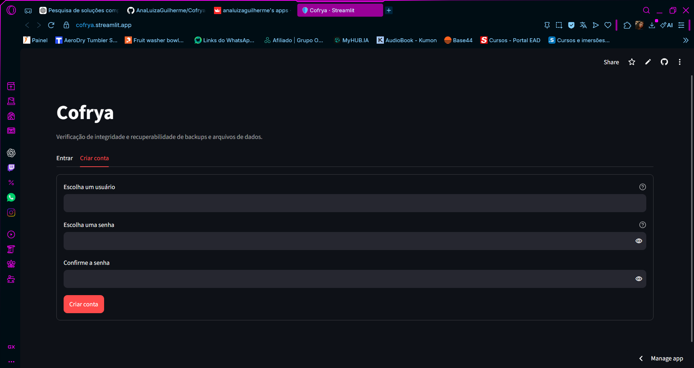
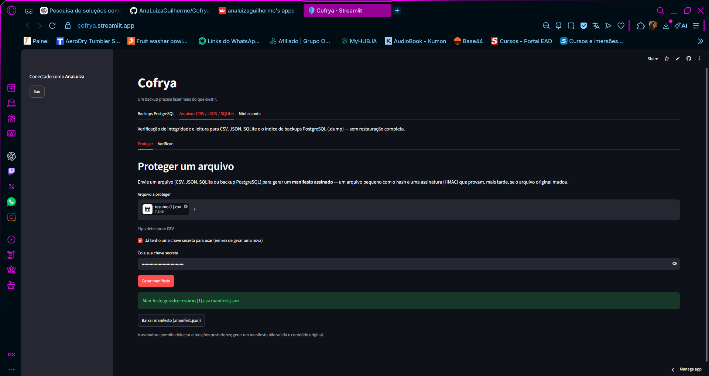

# Cofrya

**Um backup precisa fazer mais do que existir.**

Cofrya é um protótipo acadêmico em Python e Streamlit que verifica backups lógicos PostgreSQL por etapas: existência, autenticação do manifesto, integridade, restauração temporária e validação dos dados recuperados.

- **Aplicação:** [cofrya.streamlit.app](https://cofrya.streamlit.app)
- **Código:** [AnaLuizaGuilherme/Cofrya-Validacao-e-recuperacao-de-backups](https://github.com/AnaLuizaGuilherme/Cofrya-Validacao-e-recuperacao-de-backups)
- **TCC:** [texto completo atualizado](docs/TCC_Cofrya.md)
- **Resultados observados:** [matriz agregada](docs/resultados/matriz_observada.csv), [métricas](docs/resultados/metricas.json) e [critério de seleção](docs/resultados/README.md).

## Produto implementado

Cadastro, login, troca de senha e histórico por conta; upload de `.dump`, manifesto e referências; execução das configurações A, B, C_sem_func e C; exportação dos resumos e evidências em CSV. O módulo complementar protege e verifica CSV, JSON, SQLite e o índice de arquivos PostgreSQL. Para `.dump`, a leitura do índice **não comprova restauração nem correção do conteúdo**.

A interface chama o executor Python diretamente. Na hospedagem pública, o Neon fornece PostgreSQL temporário: um branch por tentativa e um banco novo dentro dele. O banco é confirmado por SQL antes de `pg_restore`, usando conexão direta (`pooled=false`) ao endpoint de escrita. Ao final, o programa solicita a remoção do branch. Docker permanece disponível para execução local.

O Neon não armazena as contas nem o histórico do aplicativo nesta versão. Esses dados ficam no disco do processo Streamlit. Os ensaios relatados usaram Neon; os limites de CPU/memória do adaptador Docker não se aplicam à nuvem.

## Configurações e cenários C0–C7

| Configuração | Significado da aprovação |
| --- | --- |
| A | Backup e manifesto existem. |
| B | A + manifesto autenticado, ID e idade autorizados, tamanho e SHA-256 corretos. |
| C_sem_func | B + restauração concluída com `pg_restore --exit-on-error`. |
| C | C_sem_func + presença das cinco tabelas, contagens e regra de totalização dos pedidos. |

A validação C é específica do esquema sintético de pedidos. Não verifica todas as colunas, todos os identificadores ou todas as regras de aplicações arbitrárias. As referências precisam ser confiáveis e anteriores à injeção de falhas; o hash das referências registrado no resumo identifica o arquivo, mas não autentica sua origem.

### Matriz esperada

Condições: arquivos correspondentes ao cenário, chave correta, limite de 30 dias e ambiente disponível. Para C5, o papel `papel_leitura_restrita` deve estar ausente no destino e **não** ser informado no campo de dependências a preparar.

| Cenário | A | B | C_sem_func | C |
| --- | --- | --- | --- | --- |
| C0 — cópia válida | Aprova | Aprova | Aprova | Aprova |
| C1 — truncamento após assinatura | Aprova | Reprova | Reprova | Reprova |
| C2 — byte alterado após assinatura | Aprova | Reprova | Reprova | Reprova |
| C3 — tabela pagamentos omitida antes da assinatura | Aprova | Aprova | Aprova | Reprova |
| C4 — total de pedido incorreto antes da assinatura | Aprova | Aprova | Aprova | Reprova |
| C5 — papel necessário à restauração ausente | Aprova | Aprova | Reprova | Reprova |
| C6 — manifesto autêntico com captura antiga | Aprova | Reprova | Reprova | Reprova |
| C7 — arquivo e manifesto adulterados sem HMAC válido | Aprova | Reprova | Reprova | Reprova |

Selecionar o cenário apenas **rotula** a tentativa; não modifica o backup. O nome `pedidos_seedN_cX.dump` permite preencher o ID, mas não substitui a autenticação do manifesto. A tela confere cenário/semente e exige referências válidas para C antes de restaurar. Problemas de infraestrutura permanecem inconclusivos; não constituem uma classe adicional de falha do backup.

### Resultados observados

A exportação de 23–24/09/2026 (UTC), versão **0.2.2**, contém 40 linhas. Foram preservados 31 ensaios: a primeira tentativa cronológica de cada combinação válida. Sete repetições e dois registros com ID `Oii` foram excluídos da análise, mas permanecem no CSV original entregue à autora como material suplementar do TCC. Os registros detalhados, com UUIDs e horários individuais, não estão publicados neste repositório. A decisão e a duração não participaram do critério de seleção.

Os resultados registrados coincidem com a matriz esperada nas **31 combinações observadas**: 16 aprovações, 15 reprovações e nenhuma inconclusão. **C7/C_sem_func não consta da exportação**; sua rejeição é esperada, mas não foi medida neste conjunto. A cobertura é 31/32 (96,875%).

No conjunto comum C1–C6, A detectou 0/6 falhas; B, 3/6; C_sem_func, 4/6; C, 6/6. C3 e C4 demonstram o ganho funcional: restauraram sem erro e só foram reprovados por C. Essas proporções descrevem uma semente e um volume; não são estimativas de eficácia geral. Tempos de restauração das tentativas que chegaram à etapa: 256,970–335,021 s. Validação funcional em C0/C3/C4: 3,944–3,974 s. CPU, memória e espaço não foram medidos.

Para reproduzir a consolidação (somente biblioteca padrão Python):

Para reproduzir, coloque a exportação original do material suplementar em `docs/resultados/resumo_original_2026-09-24.csv` e execute:

```bash
python scripts/consolidar_resultados.py
```

O script gera localmente os registros selecionados e a auditoria detalhada. Esses arquivos ficam fora do versionamento público; a matriz e as métricas agregadas estão disponíveis acima.

A versão **0.2.3** delimita o protocolo a C0–C7, corrige o catálogo negativo de C5 e publica a análise. Os CSVs históricos mantêm a versão original; os testes automatizados não substituem os ensaios no Neon.

## Imagens da aplicação

Capturas fornecidas pela autora, realizadas em 23/09/2026. São ilustrações da interface; as contagens científicas vêm dos CSVs consolidados. Foram selecionadas imagens sem chaves em texto aberto.

### Acesso e cadastro


<details><summary>Cadastro de usuário</summary>



</details>

### Verificação PostgreSQL


### Restauração bem-sucedida com reprovação funcional


### Proteção e leitura de arquivos




## Instalação e publicação

Python 3.10 ou superior; suíte validada em Python 3.12.

```bash
python -m pip install -r requirements.txt
python -m streamlit run streamlit_app.py
```

No Streamlit Community Cloud, selecione este repositório, branch `main` e arquivo `streamlit_app.py`. Em **Settings → Secrets**, informe os valores reais fora do código:

```toml
TCC_HMAC_KEY = "sua-chave-do-laboratorio"
NEON_API_KEY = "sua-chave-da-api-neon"
NEON_PROJECT_ID = "seu-projeto-neon"
```

Use projeto Neon exclusivo para o laboratório e papel `neondb_owner`. O cliente `pg_restore` instalado por `packages.txt` precisa ser compatível com o dump. A e B dispensam o banco temporário. C e C_sem_func exigem os clientes PostgreSQL e o provedor configurado. Não é necessário manter o computador da autora ligado para o aplicativo hospedado executar.

Um branch Neon herda o estado do pai, inclusive papéis. O Cofrya cria um **banco novo** para impedir que tabelas herdadas sejam confundidas com dados restaurados. Para C5, confira também a ausência do papel no branch pai. Falhas na remoção devem ser verificadas no console. Não há garantia de isolamento físico de CPU/memória nem ambiente adequado para SQL hostil.

## Contas, segurança e limites

- Contas em SQLite local; senhas derivadas por PBKDF2-HMAC-SHA-256, salt aleatório e comparação em tempo constante. Oito falhas de login bloqueiam novas tentativas da conta dentro de uma janela de 10 minutos.
- Pastas por usuário, limites de upload e limpeza da sessão ao sair. Execução sequencial por processo; não há fila distribuída nem recuperação automática de trabalhos interrompidos.
- O Community Cloud não garante persistência do disco local. Baixe resultados e arquivos importantes. `COFRYA_DATA_DIR` permite escolher um volume persistente em hospedagens que o ofereçam.
- Os resultados contêm UUID, motivo, versão, início UTC, provedor, hash das referências e durações. O tempo total inclui limpeza. Campos `NA` não significam zero.
- Execute apenas dumps sintéticos confiáveis. O manifesto não criptografa dados nem demonstra que a origem estava correta. Segredos não devem ser versionados.

A ferramenta complementar, sem manifesto, informa apenas leitura/estrutura. Com manifesto autenticado, confere também integridade. No caso de `.dump`, usa `pg_restore --list`; para restauração real, use a aba **Backups PostgreSQL**.

## Organização e linha de comando

| Componente | Responsabilidade |
| --- | --- |
| `streamlit_app.py`, `cofrya_app.py` | Entrada, autenticação e navegação |
| `postgres_app.py`, `arquivos_app.py` | Verificação PostgreSQL e arquivos genéricos |
| `src/executor.py`, `src/results.py` | Etapas, decisões, métricas e CSVs |
| `src/manifest.py`, `src/validators.py` | Autenticação, integridade e validação funcional |
| `src/adapters/` | PostgreSQL, Neon, Docker e arquivos |
| `src/auth.py`, `src/safe_files.py` | Contas e validação dos caminhos/uploads |
| `scripts/consolidar_resultados.py` | Seleção auditável da amostra do TCC |
| `verificador_backups/` | Redirecionamentos para entradas antigas |

```bash
# Defina TCC_HMAC_KEY no ambiente e use somente um banco de origem de laboratório.
python -m src.cli gerar-base --semente 1 --volume 1000 --saida ./repositorio --dsn-origem "postgresql://..."
python -m src.cli verificar --copia-id pedidos_seed1_c0 --config C --repositorio ./repositorio --cenario C0 --semente 1 --provedor-ambiente neon --saida ./results
# A matriz CLI utiliza o adaptador Docker por padrão.
python -m src.cli matriz --repositorio ./repositorio --catalogo ./config/catalog.example.json --configs A --configs B --configs C_sem_func --configs C --saida ./results
```

Sem `--dsn-origem`, o gerador produz SQL e um **placeholder**, que não é backup restaurável. Gere os cenários separadamente antes de executar a matriz. O catálogo negativo de C5 deixa `dependencias` vazio; informar o papel ausente transforma o ensaio em um controle com a dependência atendida.

## Verificação do código

```bash
python -m pip install -r requirements-dev.txt
python -m pytest -q tests
```

80 testes passaram na revisão 0.2.3. A suíte cobre manifesto, uploads, login, cenários, decisões, falhas de conexão, limpeza, seleção dos dados e fluxo de interface. Os testes de infraestrutura usam substitutos controlados; não são novas restaurações na nuvem. GitHub Actions executa a suíte em pushes para `main` e pull requests.

## Documentação técnica

[Neon: branches](https://neon.com/docs/introduction/branching) · [API de branches](https://api-docs.neon.tech/reference/createprojectbranch) · [Conexão Neon](https://api-docs.neon.tech/reference/getconnectionuri) · [PostgreSQL: pg_restore](https://www.postgresql.org/docs/17/app-pgrestore.html) · [Streamlit: segredos](https://docs.streamlit.io/deploy/streamlit-community-cloud/deploy-your-app/secrets-management) · [Streamlit: persistência](https://docs.streamlit.io/develop/concepts/connections/connecting-to-data).
