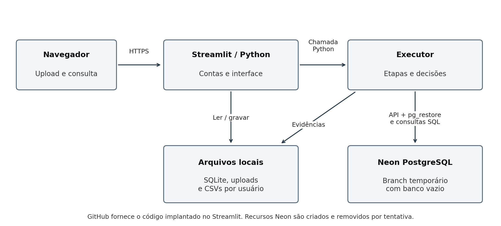
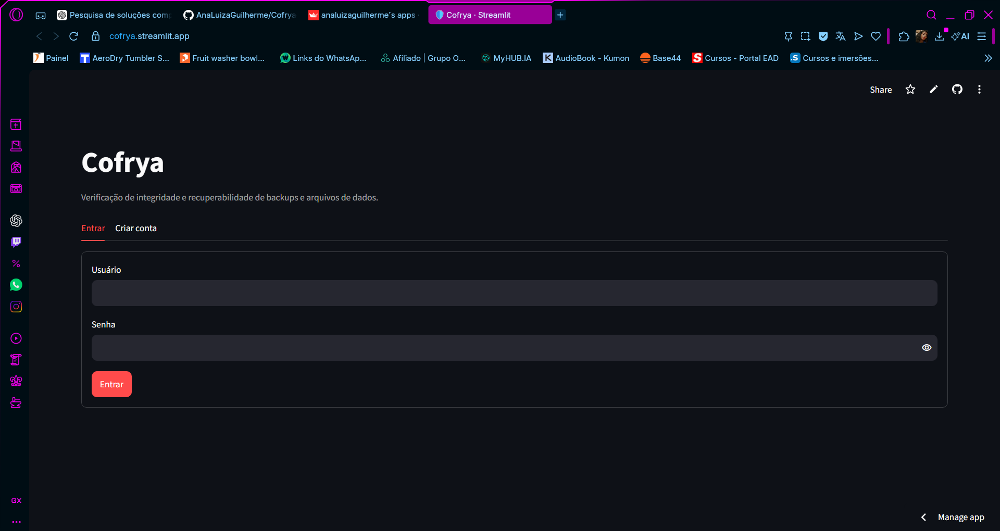
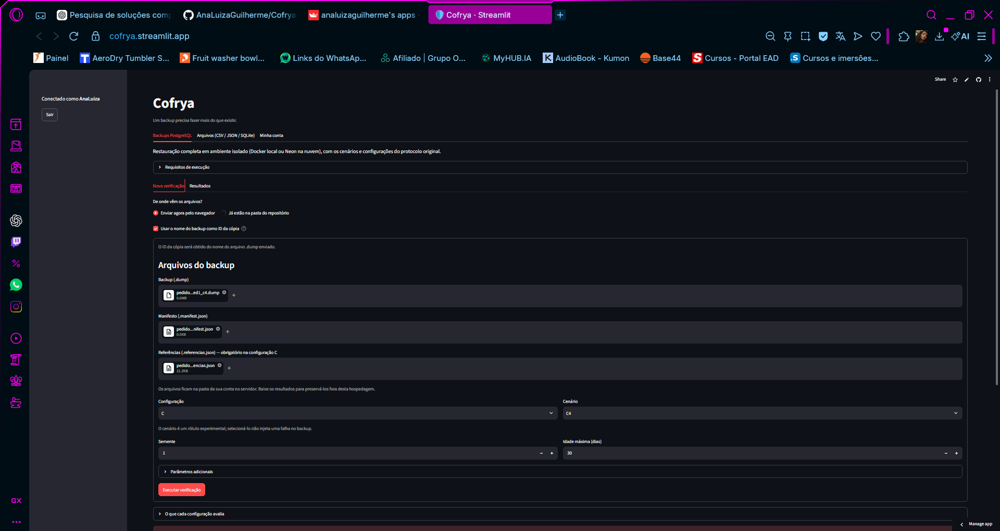
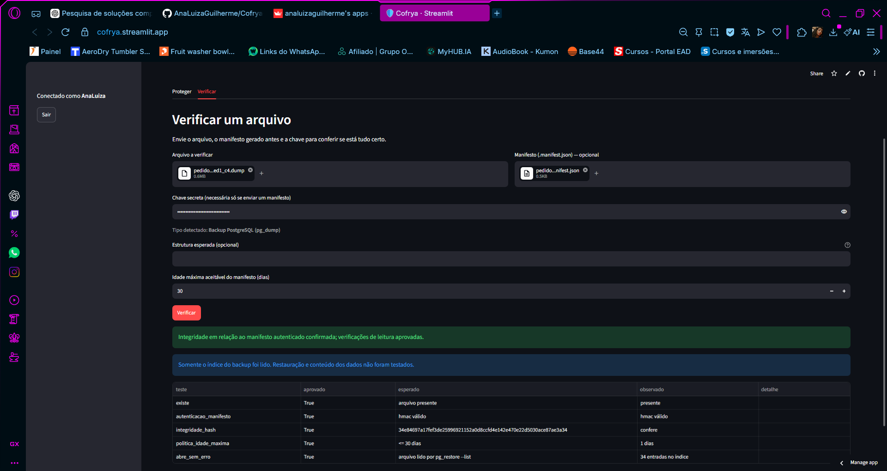
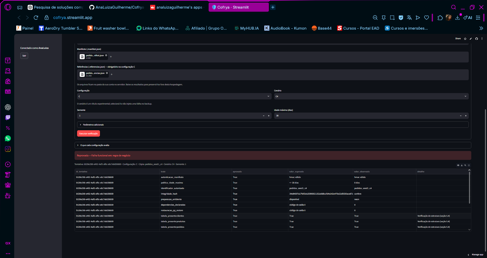

# COFRYA

## Verificação automatizada da integridade e da recuperabilidade de backups de bancos de dados

Ana Luiza Guilherme

2026

# RESUMO

A existência de uma cópia de segurança não demonstra, isoladamente, sua capacidade de recuperar dados corretos. Este trabalho desenvolveu e avaliou o Cofrya, protótipo em Python e Streamlit para verificação de backups lógicos PostgreSQL. A solução combina manifesto autenticado por HMAC-SHA-256, conferência de integridade, restauração temporária no Neon e validações de estrutura, contagens e totalização de pedidos. Foram comparadas quatro configurações: A, baseada na existência dos arquivos; B, que acrescenta autenticação, política temporal e integridade; C_sem_func, que acrescenta restauração; e C, que inclui validação funcional. O protocolo compreende os cenários C0–C7, preparados com dados sintéticos de uma base de mil pedidos e semente 1. Após a exclusão auditável de repetições e de registros com identificação incompatível, foram analisadas 31 tentativas. A combinação C7/C_sem_func não possui registro. No conjunto comum de falhas C1–C6, A identificou zero de seis falhas; B, três; C_sem_func, quatro; e C, seis. A configuração C detectou a omissão de tabela e a inconsistência de totalização que passaram pela autenticação e pela restauração. Os tempos foram analisados de forma descritiva, sem estimar estabilidade de desempenho. Os resultados sustentam, no recorte observado, o valor de verificar os dados após restaurar. O estudo é exploratório: uma semente, um volume e uma execução selecionada por combinação não permitem generalizar taxas de detecção. A aplicação, o código, a matriz e as métricas agregadas estão disponíveis publicamente no Streamlit e no GitHub. Os registros completos e a auditoria acompanham o trabalho como material suplementar entregue à autora.

Palavras-chave: cópias de segurança; PostgreSQL; recuperabilidade; validação funcional; Streamlit; Neon.

# ABSTRACT

The existence of a backup does not, by itself, demonstrate that it can recover correct data. This study developed and evaluated Cofrya, a Python and Streamlit prototype for verifying PostgreSQL logical backups. The solution combines HMAC-SHA-256 authenticated manifests, integrity checks, temporary restoration on Neon, and validation of table presence, record counts, and order totals. Four configurations were compared: A checks file existence; B adds authentication, age policy, and integrity; C_sem_func adds restoration; and C adds functional validation. The protocol covers scenarios C0–C7, prepared with a synthetic database of one thousand orders and seed 1. After auditable exclusion of repeated attempts and records with incompatible identifiers, 31 attempts were analyzed. The combination C7/C_sem_func was not recorded. In the common set of faulty scenarios C1–C6, A detected zero out of six faults, B detected three, C_sem_func detected four, and C detected all six. Configuration C detected an omitted table and inconsistent order totals despite successful authentication and restoration. Execution times were analyzed descriptively, without estimating performance stability. These observations support checking recovered data in addition to restoring it within the scope examined. The study is exploratory: one seed, one data volume, and one selected execution per combination do not establish general detection rates. The application, source code, results matrix, and aggregate metrics are publicly available on Streamlit and GitHub. The complete records and selection audit accompany the thesis as supplementary material delivered to the author.

Keywords: backups; PostgreSQL; recoverability; functional validation; Streamlit; Neon.

# 1 INTRODUÇÃO

A continuidade de sistemas informatizados depende tanto da preservação de arquivos quanto da possibilidade de recuperar operações e dados coerentes. Cópias de segurança ocupam um lugar central nesse processo, mas a mensagem de sucesso de uma exportação descreve somente uma etapa. Entre o momento da captura e a utilização de um backup podem surgir truncamento, alteração de bytes, desatualização, troca de arquivos e incompatibilidades do ambiente de destino. A própria origem pode produzir uma exportação incompleta ou registrar informações inconsistentes antes da assinatura do arquivo.

A ANPD (2021) inclui controles de acesso e cópias de segurança entre as medidas orientativas de segurança da informação para agentes de tratamento de pequeno porte. O planejamento de contingência também articula recuperação, prioridades operacionais e testes de procedimentos, conforme Swanson et al. (2010). Essas referências fundamentam a relevância do tema, sem implicar que a ferramenta desenvolvida certifique conformidade normativa ou substitua um plano organizacional de continuidade.

Incidentes de ransomware ampliam o interesse por recuperação, mas não esgotam o problema. Sarabi et al. (2025) estudam a evolução desses incidentes por meio de um conjunto longitudinal de relatos. O presente trabalho não reproduz ataques de ransomware nem estima sua incidência. Seu foco é uma questão operacional mais delimitada: quais evidências permitem distinguir a presença de um arquivo da recuperação de um conjunto de dados utilizável?

Para investigar essa questão, foi desenvolvido o Cofrya. O protótipo oferece acesso por navegador, geração e verificação de manifestos, restauração controlada de backups PostgreSQL e apresentação de evidências por tentativa. A versão final utiliza Python e Streamlit na interface e no executor, com Neon como provedor de PostgreSQL temporário nos ensaios em nuvem. O código também mantém um adaptador Docker para uso local, mas os resultados analisados neste trabalho pertencem exclusivamente ao conjunto exportado com provedor Neon.

## 1.1 Problema e delimitação

O problema de pesquisa é a insuficiência de verificações que tratam existência, integridade binária e recuperabilidade como propriedades equivalentes. Um backup pode existir, corresponder ao hash de um manifesto autêntico e ser restaurado sem erro, mas não conter uma tabela necessária. Também pode preservar fielmente um total de pedido incorreto. Nessas situações, aprovar o arquivo a partir de critérios limitados não equivale a demonstrar sua adequação ao uso pretendido.

O recorte adotado é uma aplicação sintética de gestão de pedidos, composta por cinco tabelas em PostgreSQL. A análise considera cópias lógicas em formato customizado e oito cenários controlados, C0–C7. Não abrange recuperação de sistemas operacionais, consistência distribuída entre múltiplos serviços, restauração de ambientes empresariais completos ou detecção universal de alterações maliciosas. A validade das conclusões está vinculada aos artefatos, às regras e às condições descritas na metodologia.

## 1.2 Pergunta de pesquisa e hipótese

A pergunta que orienta o trabalho é: em backups lógicos PostgreSQL, que ganho de detecção é observado ao acrescentar restauração e validação funcional à verificação de existência, autenticação e integridade, e quais tempos são registrados nas etapas executadas?

A hipótese é que a restauração revele problemas de dependência do ambiente e que a validação funcional identifique falhas de completude e de negócio que não são detectadas pelo hash. A contrapartida esperada é a execução de etapas adicionais. A avaliação final trata o custo em termos de durações registradas: não foram obtidas medições de CPU, memória ou espaço temporário que sustentem conclusões sobre consumo computacional global.

## 1.3 Objetivos

O objetivo geral foi desenvolver e avaliar um protótipo de verificação automatizada de backups PostgreSQL, combinando autenticação, integridade, restauração temporária e testes sobre os dados recuperados.

Os objetivos específicos foram estabelecer critérios de decisão; implementar manifestos autenticados e política temporal; integrar um ambiente descartável de restauração; construir cenários sintéticos com falhas conhecidas; comparar quatro configurações de verificação; registrar decisões e durações; e disponibilizar interface, código e evidências que permitam inspecionar e reproduzir a análise.

O escopo final preserva a comparação entre etapas e explicita as entregas efetivamente realizadas. A proposta inicial de múltiplos volumes, sementes e repetições de desempenho não foi utilizada para caracterizar a amostra final. Os resultados apresentados derivam de uma semente e de um volume, com remoção das tentativas repetidas conforme regra documentada.

## 1.4 Organização e acesso ao produto

O capítulo 2 apresenta os conceitos utilizados; o capítulo 3 discute trabalhos e ferramentas relacionados; o capítulo 4 descreve o protocolo e o tratamento dos dados; o capítulo 5 documenta a implementação; o capítulo 6 analisa os resultados e suas limitações; e o capítulo 7 apresenta as considerações finais.

A aplicação está disponível em https://cofrya.streamlit.app. O repositório público está em https://github.com/AnaLuizaGuilherme/Cofrya-Validacao-e-recuperacao-de-backups. A matriz e as métricas agregadas estão em docs/resultados; as imagens, em docs/imagens. Os CSVs detalhados e a auditoria acompanham o trabalho como material suplementar entregue à autora. Esses endereços permitem relacionar a descrição acadêmica ao produto entregue.

# 2 FUNDAMENTAÇÃO TEÓRICA

## 2.1 Existência, integridade e autenticidade

Neste trabalho, existência significa que os arquivos esperados estão disponíveis no local autorizado. Integridade binária significa que tamanho e resumo criptográfico correspondem à referência autenticada. Autenticidade do manifesto significa que a mensagem foi validada com a chave compartilhada pertencente ao domínio de confiança. Essas propriedades são complementares e possuem limites distintos.

O Cofrya calcula SHA-256 sobre o conteúdo do backup e autentica os metadados com HMAC-SHA-256. Um hash sem proteção de origem permite que alguém altere simultaneamente arquivo e valor de referência. O HMAC vincula o manifesto à chave e permite detectar modificações não autorizadas dentro desse modelo. A biblioteca hmac do Python oferece o mecanismo utilizado e comparação apropriada de resumos (Python Software Foundation, s.d.). HMAC não cifra o arquivo e não constitui assinatura digital assimétrica com não repúdio.

A referência autenticada descreve o arquivo que foi produzido, não a correção de todos os fatos nele contidos. Se uma exportação incompleta for assinada legitimamente, a autenticação continuará válida. De forma semelhante, um valor de negócio incorreto anterior à exportação pode ser preservado sem qualquer divergência binária. Essa separação fundamenta a criação de cenários que falham depois da restauração, embora passem pela integridade.

## 2.2 Recuperabilidade e correção funcional

Recuperabilidade é tratada como uma propriedade relativa a um procedimento e a critérios explícitos. Para a configuração C_sem_func, a evidência exigida é a conclusão da restauração nativa sem erro. Para C, exige-se adicionalmente que o banco restaurado satisfaça o conjunto de validações implementado. Nenhuma dessas decisões deve ser interpretada fora de seu escopo: C não demonstra a correção de regras que não foram verificadas.

O PostgreSQL distingue a inspeção de arquivos de backup do uso efetivo dos dados recuperados. A documentação de pg_verifybackup, voltada a backups físicos de cluster, recomenda restaurações de teste mesmo após verificações de integridade. Essa recomendação é conceitualmente pertinente ao problema investigado, embora pg_verifybackup não seja o mecanismo utilizado para os arquivos lógicos deste estudo (PostgreSQL Global Development Group, s.d.a).

Após restaurar, o Cofrya verifica a presença das tabelas esperadas, suas contagens e a igualdade entre o total declarado de cada pedido e a soma de seus itens. Essas consultas constituem um oráculo operacional limitado. Elas não comparam cada célula com a origem, não verificam todas as colunas e restrições do esquema e não exercitam todas as operações de uma aplicação real. A confiança no resultado depende também da qualidade dessas referências e regras.

## 2.3 Backup lógico PostgreSQL e restauração

O backup lógico representa objetos e dados que podem ser reconstruídos por comandos executados no servidor de destino. No formato customizado, pg_dump produz um arquivo interpretado por pg_restore. A restauração utiliza --exit-on-error para interromper a execução diante de erro, e --no-owner para não depender da reprodução dos proprietários originais. As permissões do dump continuam relevantes, aspecto utilizado no cenário de papel ausente (PostgreSQL Global Development Group, s.d.b).

A operação pg_restore --list apresenta o índice do arquivo. Ela não executa a carga dos registros nem as consultas de negócio. Por isso, o módulo complementar de leitura de arquivos do Cofrya distingue explicitamente a leitura do índice da restauração completa. Um índice legível não afasta a possibilidade de dados incorretos, dependências ausentes ou falhas em uma etapa posterior.

## 2.4 Atualidade, identidade e critérios temporais

Uma cópia antiga pode ser íntegra e autêntica, mas inadequada à política de recuperação. O trabalho utiliza uma idade máxima de 30 dias, comparada com o instante de captura declarado no manifesto autenticado. O identificador da cópia também deve corresponder ao solicitado. Esses controles permitem distinguir corrupção, adulteração e inadequação temporal.

Os objetivos RPO e RTO pertencem ao planejamento de continuidade e devem refletir necessidades organizacionais (Swanson et al., 2010). Neste estudo, a idade máxima de 30 dias é um parâmetro de laboratório; não é apresentada como RPO adequado a uma empresa. Da mesma forma, a duração de uma tentativa do Cofrya não mede um RTO empresarial, pois não inclui diagnóstico de incidente, decisão humana, retorno do serviço ou validação de toda a operação.

## 2.5 Restauração temporária em nuvem

Um ambiente temporário permite executar a restauração sem sobrepor o banco de origem utilizado pelo experimento. No Neon, branches possibilitam ramificar o estado de um projeto e realizar mudanças independentes no ramo criado (Neon, s.d.a). Entretanto, ramificar não significa iniciar automaticamente com um banco vazio: o estado do ramo pai pode ser herdado.

A implementação do Cofrya trata esse detalhe criando um novo banco dentro do branch temporário. Dessa maneira, a presença de uma tabela no banco pai não mascara sua ausência no dump. Os papéis, por pertencerem ao contexto do branch, merecem atenção específica nos testes de dependência. O isolamento empregado é lógico e operacional; o experimento não pressupõe exclusividade física de recursos do provedor.

# 3 TRABALHOS E FERRAMENTAS RELACIONADOS

## 3.1 Verificação de armazenamento e testes de recuperação

Ferramentas de backup oferecem mecanismos relevantes de integridade, mas seus resultados precisam ser associados ao que foi efetivamente examinado. O restic disponibiliza verificação de estrutura e consistência do repositório, com opções de leitura dos dados armazenados (Restic, s.d.). Essa função trata a integridade do acervo sob gestão da ferramenta. O Cofrya investiga outra camada: a reconstrução de um banco lógico e a avaliação de condições da aplicação sobre esse banco.

O AWS Backup oferece testes de restauração e recursos para acompanhar a validação dos recursos restaurados (Amazon Web Services, s.d.). A aproximação com o presente trabalho está na necessidade de ensaiar a recuperação. A diferença é o recorte: o Cofrya constitui um protótipo acadêmico com artefatos sintéticos, configurações comparáveis e verificações SQL específicas, sem pretensão de substituir a abrangência de um serviço comercial.

O pg_verifybackup é adequado ao contexto de backups físicos produzidos com pg_basebackup, enquanto o experimento utiliza arquivos lógicos customizados. A distinção evita aplicar indevidamente uma ferramenta a um formato diferente. A contribuição do Cofrya não é propor um novo hash ou um novo mecanismo de restauração, mas integrar mecanismos existentes com critérios funcionais e evidências por tentativa.

## 3.2 Estudos sobre consistência e falhas controladas

Pillai et al. (2014) mostram a complexidade dos protocolos de persistência utilizados por aplicações sobre sistemas de arquivos. Mohan et al. (2018) apresentam testes de falhas com exploração limitada e ferramentas como CrashMonkey e ACE para investigar consistência após interrupções. Esses estudos operam em camadas diferentes da restauração lógica PostgreSQL, mas reforçam a utilidade de definir falhas, estados esperados e critérios de observação antes de interpretar um resultado.

O presente estudo não injeta quedas de energia no sistema de arquivos e não reproduz os experimentos dessas publicações. Utiliza, como princípio metodológico, falhas controladas e comparações entre níveis de verificação. Cada cenário possui uma alteração principal, permitindo examinar qual etapa produz a primeira evidência de inadequação.

O sistema Iris associa mecanismos de autenticidade, integridade e recuperabilidade ao armazenamento remoto (Stefanov et al., 2012). A aproximação conceitual está na necessidade de distinguir essas propriedades. O Cofrya, por sua vez, não implementa provas criptográficas de recuperabilidade: obtém evidências operacionais pela execução da restauração e de consultas sobre os dados recuperados.

## 3.3 Posicionamento da contribuição

A contribuição prática é um fluxo acessível pelo navegador que reúne verificações progressivas e apresenta seus resultados em linguagem operacional. A contribuição experimental é a demonstração, em um domínio sintético controlado, de casos que passam por etapas anteriores e falham em etapas posteriores. O artefato também explicita decisões inconclusivas, em vez de atribuir automaticamente ao backup qualquer falha de infraestrutura.

A comparação é interna ao Cofrya: A, B, C_sem_func e C compartilham os componentes das etapas comuns. Não foi realizado benchmark entre o Cofrya, restic, AWS Backup ou outros produtos. As ferramentas relacionadas contextualizam o problema e delimitam a proposta, sem fornecer uma classificação de desempenho ou segurança entre soluções heterogêneas.

# 4 METODOLOGIA

## 4.1 Natureza da pesquisa e unidade de análise

A pesquisa é aplicada, com desenvolvimento de artefato e avaliação experimental exploratória. A unidade de análise é uma tentativa de verificação de uma cópia, sob determinada configuração, cenário e semente. A tentativa possui identificador próprio, decisão, motivo, durações e metadados de rastreabilidade.

O conjunto final utiliza a versão 0.2.2 do executor, registrada nas linhas exportadas, e provedor Neon. A revisão documental e de delimitação do protocolo foi identificada no código como 0.2.3. Essa revisão não altera a versão registrada nos ensaios anteriores nem constitui uma nova coleta. Testes automatizados do código são tratados separadamente dos registros experimentais.

As execuções foram realizadas sequencialmente pela interface. Não houve randomização da ordem documentada no CSV, distribuição entre múltiplos provedores nem repetições mantidas para estimar desempenho. A interpretação dos tempos, portanto, é descritiva e condicionada ao estado da rede e do provedor no momento de cada execução.

## 4.2 Base sintética e sementes

A base representa clientes, produtos, pedidos, itens de pedido e pagamentos. O conjunto de referência da semente 1 possui 200 clientes, 50 produtos, 1.000 pedidos, 2.976 itens e 1.000 pagamentos. Os valores são sintéticos; não foram utilizadas informações pessoais de clientes reais.

A semente controla as escolhas pseudoaleatórias do gerador. Reexecutar o mesmo gerador, com a mesma versão, volume e semente, permite reconstruir os dados esperados. A semente não é senha, não é chave HMAC e não identifica uma repetição de desempenho. Todas as tentativas selecionadas utilizaram semente 1; assim, o estudo não mede sensibilidade a diferentes distribuições de dados produzidas por outras sementes.

As referências são capturadas antes da injeção de falhas e fornecidas em arquivo JSON separado. O executor registra seu SHA-256 para rastrear a entrada utilizada. Esse registro não autentica a origem do arquivo: sua confiabilidade depende do controle exercido pela pesquisadora. O validador implementado consome as cinco contagens e calcula a regra de totalização diretamente no banco restaurado; não realiza comparação exaustiva de todos os valores com o JSON.

Tabela 1 – Composição da base de referência

| Entidade | Quantidade |
| --- | --- |
| Clientes | 200 |
| Produtos | 50 |
| Pedidos | 1.000 |
| Itens de pedido | 2.976 |
| Pagamentos | 1.000 |

Fonte: arquivos de referência do laboratório, semente 1.

## 4.3 Configurações comparadas

A configuração A confirma a existência do backup e do manifesto. B acrescenta autenticação do manifesto, identidade, política de idade máxima, tamanho e hash. C_sem_func executa B e a restauração nativa. C executa as mesmas etapas de C_sem_func e acrescenta validações funcionais. A ordem A, B, C_sem_func e C acompanha o acréscimo das verificações.

Uma aprovação possui significado relativo à configuração. Aprovação em A não comprova autenticidade; aprovação em B não comprova restauração; aprovação em C_sem_func não comprova que as regras funcionais foram atendidas. A comparação considera essa diferença para evitar que aprovações de configurações limitadas sejam apresentadas como validação completa do backup.

Tabela 2 – Etapas habilitadas por configuração

| Etapa | A | B | C_sem_func | C |
| --- | --- | --- | --- | --- |
| Existência dos arquivos | Sim | Sim | Sim | Sim |
| HMAC, ID e idade | Não | Sim | Sim | Sim |
| Tamanho e SHA-256 | Não | Sim | Sim | Sim |
| Restauração PostgreSQL | Não | Não | Sim | Sim |
| Estrutura, contagens e negócio | Não | Não | Não | Sim |

Fonte: implementação de src/executor.py.

## 4.4 Cenários C0 a C7

C0 é o controle válido. C1 reduz o arquivo para aproximadamente 70% do tamanho original depois da assinatura. C2 altera um byte depois da assinatura, mantendo o tamanho. Em ambos, o manifesto preserva a referência anterior à alteração.

C3 omite a tabela pagamentos antes da produção do manifesto válido. C4 altera o total declarado de um pedido antes da exportação e da assinatura, preservando estrutura e contagens. Esses cenários foram preparados para manter integridade e autenticidade do artefato produzido, mas violar os critérios funcionais do conjunto de referência.

C5 utiliza um dump com permissão atribuída ao papel papel_leitura_restrita, ausente no destino. O papel não deve ser criado previamente pelo campo de dependências. Se for criado, a condição de falha deixa de existir. A restauração mantém as instruções de permissão do arquivo; remover essas instruções também descaracteriza o teste. O ramo pai do Neon precisa ser considerado, pois a existência herdada do papel pode atender involuntariamente à dependência.

C6 apresenta manifesto autêntico com data de captura 400 dias anterior à preparação, ultrapassando a política de 30 dias. A data é definida antes da assinatura. C7 altera o arquivo e os metadados de integridade sem produzir um HMAC válido com a chave confiável. Seu critério discriminante é a rejeição da autenticação, independentemente de os campos de hash e tamanho parecerem coerentes.

Tabela 3 – Matriz de decisões esperadas

| Cenário | Condição principal | A | B | C_sem_func | C |
| --- | --- | --- | --- | --- | --- |
| C0 | Cópia válida | Aprova | Aprova | Aprova | Aprova |
| C1 | Truncamento | Aprova | Reprova | Reprova | Reprova |
| C2 | Byte alterado | Aprova | Reprova | Reprova | Reprova |
| C3 | Tabela omitida | Aprova | Aprova | Aprova | Reprova |
| C4 | Total inconsistente | Aprova | Aprova | Aprova | Reprova |
| C5 | Papel ausente | Aprova | Aprova | Reprova | Reprova |
| C6 | Captura antiga | Aprova | Reprova | Reprova | Reprova |
| C7 | HMAC inválido | Aprova | Reprova | Reprova | Reprova |

Fonte: elaboração própria, a partir do protocolo e das etapas implementadas.

A matriz é uma previsão condicionada à preparação correta dos artefatos, às entradas confiáveis e à disponibilidade do ambiente. A seleção do rótulo na interface não injeta a falha. O resultado esperado é definido antes da observação e não é utilizado para reescrever decisões divergentes.

## 4.5 Decisões, evidências e interrupção de etapas

A decisão é aprovada quando todas as verificações habilitadas terminam satisfatoriamente, reprovada quando uma condição verificada falha e inconclusiva quando não há condições de estabelecer o resultado exigido. Uma falha de conexão ou de preparação do ambiente não demonstra, por si, defeito no backup. A ausência de referências necessárias também impede a validação funcional.

O executor interrompe etapas posteriores quando uma verificação anterior já determina a reprovação. Assim, uma rejeição por HMAC inválido não produz tempo de restauração. Os campos ausentes são registrados como NA, e não como zero. Essa regra é essencial para interpretar corretamente os tempos e evitar atribuir baixo custo de restauração a uma etapa que não foi executada.

Os arquivos resumo.csv e evidencias.csv são ligados por id_tentativa. O primeiro apresenta o resultado agregado; o segundo contém verificações individuais, valores esperados, valores observados e detalhes. Para a análise final, a fonte quantitativa foi a exportação de resumo fornecida pela autora. As capturas de tela complementam a inspeção de etapas específicas; não substituem os CSVs nem permitem reconstruir evidências individuais ausentes de todas as tentativas.

## 4.6 Consolidação sem tentativas repetidas

A exportação original contém 40 linhas de dados. Foi preservada integralmente no material suplementar como resumo_original_2026-09-24.csv. O procedimento de seleção ordena os registros por instante de início UTC, utiliza a ordem original como desempate, exclui identificadores incompatíveis com a convenção pedidos_seed{semente}_{cenario} e conserva a primeira tentativa de cada combinação de cenário, semente, configuração, cópia, versão e provedor.

A regra foi aplicada independentemente da decisão e da duração. Não se selecionou o ensaio mais rápido, a última tentativa aprovada ou o resultado que melhor coincidia com a hipótese. Sete repetições foram excluídas da amostra analítica. Duas tentativas registraram o valor literal Oii no campo id_copia, incompatível com a convenção de identificação dos artefatos, e foram excluídas por esse critério. Os registros disponíveis não esclarecem a origem desse valor. Essas duas linhas continuam disponíveis no arquivo bruto e não foram apagadas do histórico original.

Restaram 31 combinações observadas entre as 32 possíveis. A combinação C7/C_sem_func não aparece na exportação. Ela é identificada como sem registro, categoria de completude da coleta que não se confunde com uma tentativa executada e classificada como inconclusiva. O script scripts/consolidar_resultados.py gera o conjunto selecionado, a matriz observada, as métricas e a auditoria com a relação entre tentativas repetidas e a tentativa mantida.

## 4.7 Métricas e limites da comparação

A cobertura observada é calculada por combinações registradas divididas pelas combinações previstas. A detecção de falhas é apresentada por configuração e por cenário. Para comparação direta das quatro configurações, utiliza-se o conjunto comum C1–C6, que possui observações em todas as configurações. C7 é analisado separadamente onde há registro.

Também são apresentados os tempos individuais de restauração, validação funcional e duração total. O campo tempo_decisao_s inclui a limpeza; portanto, é descrito neste trabalho como duração total registrada. A preparação inclui disponibilização do ambiente e dependências declaradas. Não há medição de tempo de fila, CPU, memória máxima ou espaço temporário na exportação utilizada.

As proporções são descritivas do conjunto de falhas preparado. Não representam probabilidades de detecção em uma população de backups. Não foram calculados intervalos de confiança, testes de significância ou médias de repetições, pois a amostra final não foi planejada para essas inferências. O controle C0 possui apenas uma observação por configuração, insuficiente para estimar uma taxa geral de falsos alertas.

# 5 DESENVOLVIMENTO E PRODUTO FINAL

## 5.1 Arquitetura implementada

O produto final concentra interface e orquestração em Python e Streamlit. streamlit_app.py inicia a aplicação; cofrya_app.py organiza autenticação e navegação; postgres_app.py apresenta o fluxo de backups; e arquivos_app.py oferece o módulo complementar de arquivos. O executor é chamado diretamente pela aplicação. Não há API FastAPI intermediária, fila persistente ou trabalhador distribuído na versão avaliada.

O repositório GitHub fornece o código implantado no Streamlit Community Cloud. O navegador é o ponto de interação, enquanto o processo hospedado executa o Python e chama os clientes PostgreSQL. Dessa forma, a execução hospedada não depende de manter o computador pessoal da autora ligado. Essa separação resolveu a necessidade de acesso externo ao protótipo, sem tornar o navegador responsável pela restauração.

O módulo src/executor.py aplica as etapas habilitadas, classifica o resultado e coordena a limpeza. Os adaptadores encapsulam arquivos, PostgreSQL, Docker e Neon. src/manifest.py implementa autenticação e integridade; src/validators.py reúne as verificações funcionais; src/results.py registra os CSVs. Os caminhos antigos em verificador_backups permanecem como entradas de compatibilidade, e a implementação principal está na raiz do repositório.

Figura 1 – Arquitetura da execução hospedada

Fonte: elaboração própria, a partir do código do Cofrya.

## 5.2 Cadastro, acesso e separação por usuário

A aplicação implementa cadastro com nome de usuário e senha, login, saída e troca de senha. As contas são mantidas em SQLite no diretório de dados do processo. A derivação de senha utiliza PBKDF2-HMAC-SHA-256 com 200.000 iterações e salt aleatório de 16 bytes; a comparação do resultado utiliza mecanismo de tempo constante. Existe limite de oito falhas por conta em uma janela de dez minutos.

Cada usuário possui diretórios próprios para repositório, resultados e arquivos de tentativa. Os nomes e caminhos passam por validação, e a saída da conta limpa o estado da sessão, inclusive resultados e chaves exibidos pela interface. Esses mecanismos organizam o uso do protótipo, mas não equivalem a autenticação corporativa, autenticação multifator ou autorização distribuída. Não foram implementados login social e confirmação por e-mail no produto final.

Figura 2 – Tela de acesso à aplicação

Fonte: captura da aplicação fornecida pela autora, 23 set. 2026.

## 5.3 Entrada de arquivos e política de verificação

Na área Backups PostgreSQL, o usuário envia backup, manifesto e, para C, referências funcionais. Por padrão, o nome do arquivo .dump define o identificador solicitado. O usuário pode informar o ID manualmente, mas isso não altera o identificador autenticado no manifesto. Para a convenção do laboratório, a interface confere a correspondência entre nome, cenário e semente.

As referências precisam constituir JSON válido com as cinco contagens esperadas, expressas como inteiros não negativos. A falta desse arquivo impede iniciar a configuração C pela interface. Essa verificação prévia evita criar um ambiente remoto quando já se sabe que a validação funcional não poderá ser concluída. A seleção da configuração e do cenário aparece junto ao resultado para facilitar a rastreabilidade.

Figura 3 – Preparação de uma tentativa C4 na configuração C

Fonte: captura da aplicação fornecida pela autora, 23 set. 2026.

O manifesto contém identidade, instante de captura, tamanho, hash e metadados de versão. A chave HMAC é configurada fora do repositório, por variável de ambiente ou pelos segredos do Streamlit. A plataforma disponibiliza mecanismo específico para manter segredos separados do código publicado (Streamlit, s.d.b). A chave não é incluída nas figuras deste trabalho nem nos dados publicados.

## 5.4 Restauração e validações PostgreSQL

O executor trabalha com uma cópia protegida do arquivo, autentica o manifesto e confere identidade, idade e integridade antes das etapas de restauração. A criação do ambiente ocorre somente nas configurações que precisam dele e após a aprovação das verificações anteriores. Dependências explicitamente declaradas podem ser preparadas; isso precisa ser controlado para não eliminar a condição de falha de C5.

A restauração nativa registra código de saída e mensagens do processo. Erros de conexão são tratados como impedimentos de infraestrutura; erros de leitura ou execução do conteúdo do dump podem determinar reprovação. Não há tentativa automática de reaplicar uma restauração parcialmente concluída sobre o mesmo banco. O descarte do recurso pertence ao ciclo de finalização da tentativa.

A validação estrutural consulta as tabelas do esquema public e verifica a presença de clientes, produtos, pedidos, itens_pedido e pagamentos. A validação de conteúdo compara COUNT(*) de cada tabela com a referência. A regra de negócio compara, para cada pedido, total_declarado com a soma de quantidade multiplicada por preco_unitario de seus itens. A comparação monetária usa Decimal, duas casas decimais e arredondamento explícito.

As consultas de validação são somente leitura. A verificação não inclui inserções de pedidos, simulação de pagamento, testes de APIs de negócio ou comparação integral de cada registro com a origem. Identificadores aparecem nas consultas e nas evidências de divergência, mas não existe uma etapa geral de conferência de todos os conjuntos de IDs. Esses limites são parte da especificação efetivamente avaliada.

## 5.5 Integração com Neon

Nos ensaios hospedados, o adaptador Neon utiliza NEON_API_KEY e NEON_PROJECT_ID para solicitar, pela API, a criação de um branch associado ao UUID da tentativa. A API também permite obter a conexão do recurso criado (Neon, s.d.b; Neon, s.d.c). O Cofrya solicita endpoint de escrita, cria um banco vazio com nome específico e obtém uma conexão direta, sem pool.

O adaptador confere o destino e aguarda uma consulta SQL confirmar o nome do banco antes de iniciar pg_restore. Essa etapa foi acrescentada para distinguir o estado administrativo do endpoint da efetiva disponibilidade do banco recém-criado. Um endpoint ativo, isoladamente, não é utilizado como prova de que a restauração já pode começar.

A criação de um banco vazio dentro do branch é necessária porque um branch herda o estado do pai. Restaurar no banco herdado poderia fazer uma tabela omitida parecer recuperada. O novo banco evita essa interferência para as tabelas do experimento. Papéis e outras características do branch continuam exigindo controle; no ensaio de C5, um papel herdado pode modificar a condição experimental.

A conexão usa os parâmetros retornados para o branch e banco da tentativa, e a senha é transmitida ao cliente por ambiente de processo. A comunicação PostgreSQL utiliza SSL requerido na implementação. Ao finalizar, o programa solicita excluir o branch. Falhas de remoção são registradas e exigem inspeção no console do provedor; não se pressupõe que todo descarte ocorreu apenas porque foi solicitado.

O Neon foi o provedor de restauração temporária, não o banco persistente das contas do aplicativo. Também não foi utilizado como substituto de um repositório permanente de backups. A interface pública permaneceu no Streamlit, e o GitHub permaneceu como repositório de código. A solução final não depende da publicação anterior em Hostinger nem de recursos Azure para executar o fluxo descrito.

## 5.6 Histórico, métricas e persistência

O histórico permite filtrar cenário, configuração e decisão, consultar motivos, selecionar uma tentativa e baixar seus registros. Cada resumo inclui UUID, versão do código, instante UTC, provedor e hash das referências quando aplicável. O identificador da tentativa liga a decisão agregada às verificações individuais.

As durações são obtidas com relógio monotônico. Preparação, restauração, validação e limpeza são campos separados, e a duração total termina após a finalização. A instrumentação existente deixa CPU, memória e espaço como NA. Esses campos não foram preenchidos retrospectivamente a partir de estimativas.

O controle de execução é sequencial no processo da aplicação. O bloqueio em memória não constitui uma fila distribuída, e não oferece persistência de trabalhos após interrupção do processo. Uma nova submissão gera uma nova tentativa, razão pela qual a consolidação científica precisa tratar repetições explicitamente.

Contas, uploads e CSVs permanecem no disco do servidor Streamlit. A documentação do Community Cloud não garante persistência do armazenamento local (Streamlit, s.d.a). Assim, a exportação dos resultados é necessária para a preservação do experimento. A evolução para armazenamento externo persistente é trabalho futuro; não foi apresentada como funcionalidade já implementada.

## 5.7 Módulo complementar de arquivos

Além do fluxo PostgreSQL, o produto possui as opções Proteger e Verificar para CSV, JSON, SQLite e arquivos de dump. Proteger gera um manifesto autenticado; Verificar examina o arquivo e, quando fornecido manifesto com chave válida, sua integridade em relação à referência. Gerar um manifesto não prova que o conteúdo original estava correto.

Sem manifesto, a interface informa que a integridade em relação ao original não foi avaliada. Para dumps PostgreSQL, informa que somente o índice foi lido e que restauração e conteúdo não foram testados. Essa distinção impede equiparar a ferramenta complementar às configurações C_sem_func e C. Seus resultados não foram misturados à matriz experimental.

Figura 4 – Verificação de índice e aviso sobre o limite da análise

Fonte: captura da aplicação fornecida pela autora, 23 set. 2026.

## 5.8 Evolução, testes e entregáveis

As mudanças consolidadas incluem interface Streamlit com contas, organização dos arquivos por usuário, integração Neon, conexão direta e espera SQL, banco temporário vazio, identificação automática da cópia pelo nome, exigência prévia de referências para C e registro mais explícito dos metadados. A versão final do protocolo contém exclusivamente C0–C7.

Na revisão 0.2.3, o catálogo de exemplo de C5 deixa de preparar o papel cuja ausência constitui a falha. Os testes também verificam a consistência do catálogo, a rejeição de rótulos fora do protocolo e a seleção cronológica independente da decisão. Ao todo, 80 testes automatizados passaram nessa revisão. A suíte utiliza substitutos controlados nos testes de infraestrutura; esse número não corresponde a 80 restaurações no Neon.

Os entregáveis são código executável, instruções de instalação, aplicação hospedada, geradores e artefatos sintéticos, registros originais, dados consolidados, auditoria da seleção, imagens da interface e este relatório. A documentação não apresenta como concluídos os componentes da arquitetura inicialmente planejada que não fazem parte do produto, como fila persistente, API intermediária e monitoramento de consumo por processo.

# 6 RESULTADOS E DISCUSSÃO

## 6.1 Amostra efetivamente analisada

Os registros originais foram iniciados entre 23 de setembro de 2026, às 23:26 UTC, e 24 de setembro de 2026, às 01:56 UTC. Isso corresponde à noite de 23 de setembro no fuso UTC−3, coerente com as datas visíveis nas capturas. Todas as 31 linhas selecionadas registram versão 0.2.2, semente 1 e provedor Neon. Em A e B, esse campo identifica o provedor configurado, embora essas configurações não criem um banco temporário.

A seleção resultou em 16 aprovações e 15 reprovações. Não houve decisão inconclusiva na amostra retida. A cobertura foi de 31/32, ou 96,875%. Os 40 registros não devem ser tratados como 40 unidades independentes do experimento: sete repetem combinações e dois correspondem a identificação incompatível.

Tabela 4 – Composição da amostra analítica

| Categoria | Quantidade |
| --- | --- |
| Registros no arquivo original | 40 |
| Repetições excluídas | 7 |
| Identificações incompatíveis excluídas | 2 |
| Tentativas retidas | 31 |
| Combinações sem registro | 1 |
| Aprovações na amostra | 16 |
| Reprovações na amostra | 15 |
| Inconclusivas na amostra | 0 |

Fonte: consolidação de resumo_original_2026-09-24.csv.

## 6.2 Matriz de resultados observados

A Tabela 5 apresenta somente decisões registradas. Nas 31 células observadas, as decisões coincidiram com as previsões do protocolo. A célula sem registro não foi preenchida com a decisão esperada nem com resultados de testes locais.

Tabela 5 – Decisões observadas sem repetições

| Cenário | A | B | C_sem_func | C |
| --- | --- | --- | --- | --- |
| C0 | Aprovada | Aprovada | Aprovada | Aprovada |
| C1 | Aprovada | Reprovada | Reprovada | Reprovada |
| C2 | Aprovada | Reprovada | Reprovada | Reprovada |
| C3 | Aprovada | Aprovada | Aprovada | Reprovada |
| C4 | Aprovada | Aprovada | Aprovada | Reprovada |
| C5 | Aprovada | Aprovada | Reprovada | Reprovada |
| C6 | Aprovada | Reprovada | Reprovada | Reprovada |
| C7 | Aprovada | Reprovada | Sem registro | Reprovada |

Fonte: resumo_sem_repeticoes.csv. Sem registro não é decisão inconclusiva.

C0 foi aprovado nas quatro configurações. Isso demonstra que o conjunto válido utilizado não foi rejeitado nas tentativas selecionadas. A evidência é restrita a esse controle: não permite estimar uma taxa geral de falsos positivos nem assegurar que qualquer outro backup válido seria aceito.

C1 e C2 foram aprovados por A e rejeitados pelas configurações que verificam integridade. Os motivos registrados são divergência de hash ou tamanho. Não foi necessário restaurar esses arquivos para produzir a reprovação. A comparação mostra que a mera presença dos artefatos não discrimina alterações posteriores à assinatura.

C3 passou por A, B e C_sem_func, mas foi reprovado por C por falha de estrutura e conteúdo. A restauração pôde concluir porque reconstruiu os objetos presentes no arquivo, sem que isso demonstrasse a presença de tudo o que a aplicação exigia. C4 seguiu o mesmo padrão de aprovação nas etapas anteriores e reprovação funcional, com motivo de regra de negócio.

C5 foi aprovado por A e B e reprovado nas duas configurações com restauração. O resumo registra falha na restauração nativa, resultado compatível com o cenário preparado de papel ausente. Como a exportação quantitativa não contém o stderr individual desses dois ensaios, ela não permite confirmar isoladamente a mensagem SQL específica que causou a falha. A atribuição à dependência decorre do procedimento de preparação e deve ser interpretada com essa limitação documental.

C6 foi rejeitado em B, C_sem_func e C pela política de idade máxima. C7 foi rejeitado em B e C por autenticação do manifesto. Embora C_sem_func compartilhe a mesma etapa de autenticação e sua reprovação seja prevista, falta uma tentativa correspondente na exportação. Não se confunde essa previsão do código com observação experimental.

## 6.3 Ganho de detecção por etapa

A comparação completa das quatro configurações utiliza C1–C6, conjunto com seis falhas e registros em todas as configurações. A detectou 0/6, B detectou 3/6, C_sem_func detectou 4/6 e C detectou 6/6. Os percentuais correspondentes são 0%, 50%, 66,7% e 100% no conjunto controlado.

Tabela 6 – Detecção no conjunto comum C1–C6

| Configuração | Falhas detectadas | Falhas observadas | Proporção |
| --- | --- | --- | --- |
| A | 0 | 6 | 0% |
| B | 3 | 6 | 50,0% |
| C_sem_func | 4 | 6 | 66,7% |
| C | 6 | 6 | 100,0% |

Fonte: elaboração própria a partir dos registros selecionados.

O acréscimo de restauração à configuração B produziu a detecção adicional de C5. O acréscimo de validação funcional à configuração C_sem_func produziu duas detecções adicionais, C3 e C4, diferença de 33,3 pontos percentuais no conjunto comum. Essa diferença é uma contagem descritiva de cenários preparados, não uma estimativa de ganho em produção.

Considerando também C7 onde há observação, B rejeitou quatro das sete falhas e C rejeitou as sete. C_sem_func possui quatro rejeições entre seis falhas observadas, com C7 ausente. Comparar esses denominadores distintos sem explicitar a falta de registro produziria uma conclusão incompleta. Por esse motivo, o argumento principal utiliza o conjunto comum.

O resultado mais relevante é qualitativo e causalmente delimitado pelo desenho dos artefatos: a assinatura de uma exportação incompleta ou de dados inconsistentes pode ser válida. A restauração sem erro também pode reconstruir fielmente esse estado inadequado. A validação funcional acrescenta um critério sobre o uso dos dados, além de sua preservação e reconstrução.

## 6.4 Tempos registrados

As configurações A e B concluíram suas tentativas em menos de 0,009 segundo no conjunto retido. Valores tão curtos descrevem verificações locais de arquivos pequenos e não constituem garantia de latência para backups maiores. As tentativas de C_sem_func e C rejeitadas antes da restauração também permaneceram na faixa de milissegundos, pois não criaram o ambiente remoto.

Oito tentativas chegaram à restauração: C0, C3, C4 e C5, em C_sem_func e C. Seus tempos de restauração variaram entre 256,970 e 335,021 segundos. Na configuração C, apenas C0, C3 e C4 alcançaram a validação funcional, com duração entre 3,944 e 3,974 segundos. Em C5, a falha de restauração impediu essa etapa.

Tabela 7 – Durações das tentativas que chegaram à restauração, em segundos

| Cenário | Configuração | Preparação | Restauração | Validação | Total |
| --- | --- | --- | --- | --- | --- |
| C0 | C_sem_func | 6,184 | 335,021 | NA | 341,560 |
| C0 | C | 6,454 | 314,805 | 3,974 | 325,603 |
| C3 | C_sem_func | 6,379 | 257,531 | NA | 264,256 |
| C3 | C | 6,106 | 256,970 | 3,962 | 267,366 |
| C4 | C_sem_func | 5,907 | 318,582 | NA | 324,842 |
| C4 | C | 6,198 | 319,872 | 3,944 | 330,333 |
| C5 | C_sem_func | 3,808 | 313,874 | NA | 317,963 |
| C5 | C | 6,096 | 311,614 | NA | 318,082 |

Fonte: resumo_sem_repeticoes.csv. Total inclui verificações iniciais e limpeza; NA indica etapa não executada.

A duração total não deve ser obtida apenas somando as três etapas exibidas na tabela, pois inclui verificações iniciais, limpeza e orquestração. A limpeza dos oito ensaios com restauração ficou entre aproximadamente 0,274 e 0,365 segundo. CPU, memória máxima e espaço temporário estão ausentes em todos os registros e não permitem comparação de consumo.

Em C0, o total de C foi menor que o de C_sem_func, apesar de C executar mais verificações. Essa diferença decorre dos tempos observados em execuções distintas, sobretudo da duração da restauração. Ela não demonstra que acrescentar validação acelere a recuperação. Sem repetições controladas e ordem randomizada, não é possível separar o custo marginal da validação da variabilidade de rede, inicialização e serviço remoto.

Os artefatos utilizados carregam dados por instruções INSERT. A implementação não realizou um ensaio comparativo de INSERT versus COPY, nem variou paralelismo e região. Portanto, a hipótese de influência do padrão de carga e da rede sobre os tempos é plausível, mas não foi isolada experimentalmente. O resultado defensável é a duração observada de cada etapa, nas condições efetivamente utilizadas.

## 6.5 Evidência ilustrativa de C4

A tentativa b539e298-e492-4af3-af8c-e8c7e8d36669, preservada na amostra, registra C4 na configuração C. A captura mostra autenticação, política temporal, identificador, hash, preparação do Neon e restauração aprovados. A decisão final, entretanto, é reprovação por regra de negócio.

Figura 5 – C4 restaurado sem erro e reprovado pela validação funcional

Fonte: captura da aplicação fornecida pela autora, 23 set. 2026; tentativa identificada no CSV consolidado.

A figura é utilizada como evidência ilustrativa de um fluxo específico. A tabela exibida na tela é parcial e não substitui o conjunto de registros. Para apresentação acadêmica, foram selecionadas imagens sem chaves visíveis, acompanhadas de legenda e fonte. Não foram utilizados os contadores de históricos com repetições como base para as métricas do TCC.

O módulo complementar de arquivos também consegue aprovar a leitura do índice desse dump e sua integridade em relação ao manifesto. Não há contradição: essa ferramenta verifica um subconjunto de propriedades. A diferença entre leitura do índice e validação funcional foi mantida visível na interface justamente para evitar que uma aprovação parcial seja interpretada como recuperabilidade completa.

## 6.6 Limitações e ameaças à validade

A validade interna é limitada pela execução sequencial, por uma única semente e pela ausência de repetição analítica. A infraestrutura remota pode variar entre tentativas. A remoção de repetições atendeu ao recorte solicitado e evitou contar a mesma combinação várias vezes, mas também significa que não há amostra temporal suficiente para caracterizar dispersão e estabilidade.

A validade de construção depende dos critérios implementados. Contagens iguais não garantem igualdade de todos os registros; tabelas presentes não garantem um esquema integralmente correto; e totalização consistente não demonstra correção de todas as regras de negócio. A hipótese é sustentada para as falhas preparadas, não para todas as formas possíveis de corrupção lógica.

A validade externa é restrita à base sintética de mil pedidos, aos dumps utilizados e à hospedagem observada. Não foram avaliados grandes volumes, múltiplas sementes, bancos com extensões diferentes, cargas concorrentes ou incidentes reais. Também não houve medição independente da configuração física do provedor, nem registro completo das versões de cliente e servidor em cada linha exportada. O campo de versão do código não substitui esses metadados de ambiente.

A completude documental possui duas limitações adicionais: falta C7/C_sem_func e a fonte quantitativa não contém todas as evidências individuais exportadas. Por isso, a correspondência entre decisão e cenário é apresentada com o motivo disponível no resumo, sem reconstruir mensagens SQL não fornecidas. Os arquivos brutos e a auditoria permitem verificar o que foi efetivamente selecionado.

No modelo de confiança, a chave HMAC, as referências e o executor são confiáveis. Comprometer a chave ou fornecer referências falsas pode invalidar a interpretação das verificações. O ambiente temporário não é uma sandbox para código SQL hostil, e os dados do protótipo podem desaparecer do disco local da hospedagem. Esses limites impedem apresentar o produto como solução pronta para produção crítica, certificação de segurança ou garantia universal de recuperação.

# 7 CONSIDERAÇÕES FINAIS

O trabalho entregou o Cofrya como protótipo funcional de verificação progressiva de backups lógicos PostgreSQL, acessível por navegador e integrado ao Neon para restaurações temporárias. A arquitetura implementada reúne autenticação do manifesto, integridade, restauração e validação funcional, com histórico e exportação de evidências. O módulo complementar amplia o uso para arquivos de dados, mantendo explícita a diferença entre leitura e recuperação.

Os resultados respondem à pergunta de pesquisa no recorte observado. A verificação de existência não detectou as falhas preparadas. A autenticação, a política temporal e a integridade rejeitaram alterações posteriores, captura antiga e manifesto adulterado. Houve reprovação na restauração do cenário preparado com papel ausente, sem confirmação da mensagem SQL específica na fonte quantitativa disponível. A validação funcional acrescentou a detecção de tabela omitida e totalização incorreta, mesmo quando o arquivo era autêntico e a restauração terminava sem erro.

No conjunto comum C1–C6, a detecção passou de 3/6 em B para 4/6 em C_sem_func e 6/6 em C. Os três ensaios que alcançaram a etapa funcional registraram aproximadamente quatro segundos nessa validação, enquanto a restauração concentrou a maior parte do tempo. Não se conclui, porém, que esse seja um custo fixo ou generalizável: a coleta não isolou variabilidade de infraestrutura nem mediu consumo de recursos.

A análise preservou 31 tentativas válidas, sem contar repetições e sem preencher a combinação ausente com um resultado teórico. Essa distinção entre previsão, execução e evidência é parte do resultado metodológico. A conclusão central é que verificar um backup exige definir quais propriedades se pretende demonstrar; existência, integridade e restauração são necessárias em diferentes níveis, mas não substituem critérios de correção dos dados recuperados.

Como trabalhos futuros, propõem-se completar a combinação sem registro, ampliar volumes e sementes, randomizar a ordem de execução e realizar repetições específicas de desempenho. Também são pertinentes registrar versões efetivas do ambiente, instrumentar CPU e memória, verificar persistência de resultados em armazenamento externo, ampliar o oráculo funcional e avaliar políticas de autenticação e autorização adequadas à produção. Essas ampliações devem conservar o princípio de que uma aprovação informa apenas as verificações realmente executadas.

# REFERÊNCIAS

AMAZON WEB SERVICES. Restore testing. AWS Backup Developer Guide. [s.d.]. Disponível em: https://docs.aws.amazon.com/aws-backup/latest/devguide/restore-testing.html. Acesso em: 24 set. 2026.

AUTORIDADE NACIONAL DE PROTEÇÃO DE DADOS (ANPD). Guia orientativo sobre segurança da informação para agentes de tratamento de pequeno porte. Brasília: ANPD, 2021. Disponível em: https://www.gov.br/anpd/pt-br/centrais-de-conteudo/materiais-educativos-e-publicacoes/guia-orientativo-sobre-seguranca-da-informacao-para-agentes-de-tratamento-de-pequeno-porte. Acesso em: 24 set. 2026.

GUILHERME, Ana Luiza. Cofrya: validação e recuperação de backups. Código-fonte e dados experimentais. 2026. Disponível em: https://github.com/AnaLuizaGuilherme/Cofrya-Validacao-e-recuperacao-de-backups. Aplicação: https://cofrya.streamlit.app. Acesso em: 24 set. 2026.

MOHAN, Jayashree; MARTINEZ, Ashlie; PONNAPALLI, Soujanya; RAJU, Pandian; CHIDAMBARAM, Vijay. Finding Crash-Consistency Bugs with Bounded Black-Box Crash Testing. In: USENIX SYMPOSIUM ON OPERATING SYSTEMS DESIGN AND IMPLEMENTATION, 13., 2018. Proceedings [...]. USENIX Association, 2018. p. 33–50. Disponível em: https://www.usenix.org/conference/osdi18/presentation/mohan. Acesso em: 24 set. 2026.

NEON. Branching. Neon Docs. [s.d.]a. Disponível em: https://neon.com/docs/introduction/branching. Acesso em: 24 set. 2026.

NEON. Create branch. Neon API Reference. [s.d.]b. Disponível em: https://api-docs.neon.tech/reference/createprojectbranch. Acesso em: 24 set. 2026.

NEON. Retrieve connection URI. Neon API Reference. [s.d.]c. Disponível em: https://api-docs.neon.tech/reference/getconnectionuri. Acesso em: 24 set. 2026.

PILLAI, Thanumalayan Sankaranarayana et al. All File Systems Are Not Created Equal: On the Complexity of Crafting Crash-Consistent Applications. In: USENIX SYMPOSIUM ON OPERATING SYSTEMS DESIGN AND IMPLEMENTATION, 11., 2014. Proceedings [...]. USENIX Association, 2014. p. 433–448. Disponível em: https://www.usenix.org/conference/osdi14/technical-sessions/presentation/pillai. Acesso em: 24 set. 2026.

POSTGRESQL GLOBAL DEVELOPMENT GROUP. pg_verifybackup. PostgreSQL 17 Documentation. [s.d.]a. Disponível em: https://www.postgresql.org/docs/17/app-pgverifybackup.html. Acesso em: 24 set. 2026.

POSTGRESQL GLOBAL DEVELOPMENT GROUP. pg_restore. PostgreSQL 17 Documentation. [s.d.]b. Disponível em: https://www.postgresql.org/docs/17/app-pgrestore.html. Acesso em: 24 set. 2026.

PYTHON SOFTWARE FOUNDATION. hmac: Keyed-Hashing for Message Authentication. Python Documentation. [s.d.]. Disponível em: https://docs.python.org/3/library/hmac.html. Acesso em: 24 set. 2026.

RESTIC. Working with repositories. Restic Documentation. [s.d.]. Disponível em: https://restic.readthedocs.io/en/stable/045_working_with_repos.html. Acesso em: 24 set. 2026.

SARABI, Armin; HUANG, Ziyuan; WANG, Chenlan; KARIR, Tai; LIU, Mingyan. The Ransomware Decade: The Creation of a Fine-Grained Dataset and a Longitudinal Study. In: USENIX SECURITY SYMPOSIUM, 34., 2025. Proceedings [...]. USENIX Association, 2025. p. 4799–4818. Disponível em: https://www.usenix.org/conference/usenixsecurity25/presentation/sarabi. Acesso em: 24 set. 2026.

STEFANOV, Emil; VAN DIJK, Marten; OPREA, Alina; JUELS, Ari. Iris: A Scalable Cloud File System with Efficient Integrity Checks. In: ANNUAL COMPUTER SECURITY APPLICATIONS CONFERENCE, 2012. Proceedings [...]. ACM, 2012. p. 229–238. Versão dos autores disponível em: https://eprint.iacr.org/2011/585. Acesso em: 24 set. 2026.

STREAMLIT. Connecting to data. Streamlit Docs. [s.d.]a. Disponível em: https://docs.streamlit.io/develop/concepts/connections/connecting-to-data. Acesso em: 24 set. 2026.

STREAMLIT. Secrets management for your Community Cloud app. Streamlit Docs. [s.d.]b. Disponível em: https://docs.streamlit.io/deploy/streamlit-community-cloud/deploy-your-app/secrets-management. Acesso em: 24 set. 2026.

SWANSON, Marianne et al. Contingency Planning Guide for Federal Information Systems. NIST Special Publication 800-34, Revision 1. Gaithersburg: NIST, 2010. DOI: 10.6028/NIST.SP.800-34r1. Disponível em: https://csrc.nist.gov/pubs/sp/800/34/r1/upd1/final. Acesso em: 24 set. 2026.

# APÊNDICE A – RASTREABILIDADE DA CONSOLIDAÇÃO

O arquivo original foi preservado sem modificação de bytes. Seu SHA-256 é ccc6c9fef7fb8b6f9a394358afb47930528ae757be57e54645419abb24d40d49. Para reproduzir a análise, coloque esse CSV do material suplementar em docs/resultados e execute python scripts/consolidar_resultados.py na raiz do repositório, usando a biblioteca padrão Python.

A numeração a seguir se refere às linhas de dados, sem contar o cabeçalho. Foram mantidas as linhas 1–4, 6–21 e 30–40. As linhas 5, 22 e 25–29 são repetições. As linhas 23 e 24 registram id_copia igual a Oii, valor incompatível com a convenção de identificação dos artefatos. A auditoria inclui os UUIDs completos e informa, para cada repetição, qual tentativa foi preservada.

Tabela 8 – Exclusões e tentativa preservada

| Linha excluída | Cenário/configuração | Motivo | Linha preservada |
| --- | --- | --- | --- |
| 5 | C0 / C_sem_func | Repetição | 3 |
| 22 | C4 / A | Repetição | 18 |
| 23 | C1 / A | ID Oii incompatível | Não aplicável |
| 24 | C1 / B | ID Oii incompatível | Não aplicável |
| 25 | C1 / B | Repetição | 7 |
| 26 | C1 / C_sem_func | Repetição | 8 |
| 27 | C1 / C | Repetição | 9 |
| 28 | C0 / B | Repetição | 2 |
| 29 | C0 / C_sem_func | Repetição | 3 |

Fonte: auditoria_selecao.csv.

O repositório publica matriz_observada.csv e metricas.json em docs/resultados. O material suplementar contém também resumo_original_2026-09-24.csv, resumo_sem_repeticoes.csv e auditoria_selecao.csv, com os registros detalhados. A identificação de uma repetição não depende do campo eh_repeticao_desempenho; utiliza a chave experimental e o instante registrado. A célula C7/C_sem_func permanece sem registro em todos os produtos derivados.

# APÊNDICE B – ROTEIRO DE REPRODUÇÃO DO FLUXO

A reprodução exige Python, dependências do repositório, cliente PostgreSQL compatível e credenciais Neon configuradas fora do código. Na implantação Streamlit, o arquivo principal é streamlit_app.py. TCC_HMAC_KEY, NEON_API_KEY e NEON_PROJECT_ID são fornecidos pelos segredos da aplicação. As contas são criadas na interface; a chave HMAC do laboratório não é a senha de login nem a senha do banco.

Para cada cenário, devem ser selecionados dump, manifesto e referências correspondentes. O campo Semente precisa corresponder ao gerador e ao nome do artefato. O cenário escolhido é um rótulo experimental; seus arquivos devem ter sido preparados previamente. A configuração A verifica existência; B acrescenta autenticação e integridade; C_sem_func acrescenta restauração; C exige também referências válidas.

No cenário C5, o papel requerido deve estar ausente e o campo de papéis a preparar deve ficar vazio. Criar o papel permite um controle positivo adicional, mas esse controle não deve receber o mesmo significado do ensaio negativo. Para C6, mantenha a política de 30 dias e a data antiga assinada; assinar novamente com data atual elimina a condição temporal. Para C7, não gere um novo HMAC válido sobre os arquivos adulterados.

Após executar, registre decisão, motivo e evidências; baixe os CSVs antes de reiniciar ou reimplantar a hospedagem. Confira no Neon a remoção dos branches temporários e preserve os artefatos originais. Uma execução futura deve registrar sua própria versão e seus próprios tempos. Ela não deve ser incorporada retroativamente à coleta descrita como se tivesse ocorrido nas mesmas condições.
