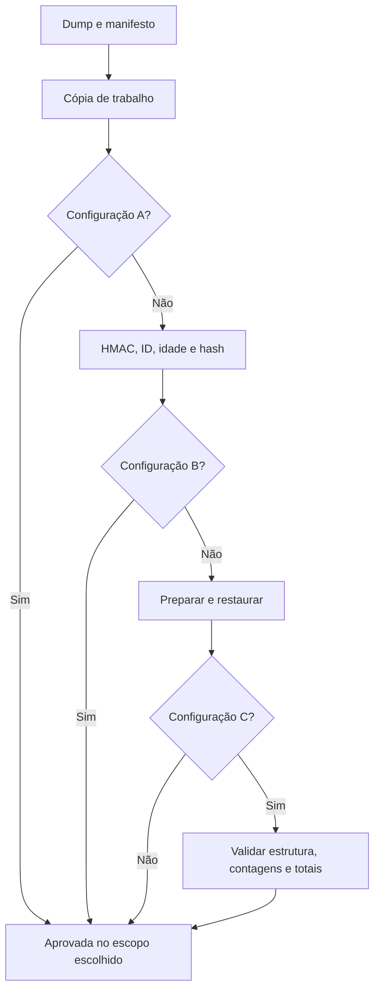

# Cofrya — Documentação técnica

Guia de implementação do verificador de backups PostgreSQL desenvolvido no TCC. A implementação descrita é a **0.2.3**, definida em [`VERSAO_CODIGO`](../src/executor.py); os ensaios consolidados foram executados na **0.2.2**.

[Aplicação](https://cofrya.streamlit.app) · [README](../README.md) · [Resultados e seleção da amostra](resultados/README.md)

## Navegação

- [Arquitetura](#arquitetura)
- [Contratos de entrada](#contratos-de-entrada)
- [Executor e decisões](#executor-e-decisões)
- [Validação funcional e SQL](#validação-funcional-e-sql)
- [API Python](#api-python)
- [CLI e geração de cenários](#cli-e-geração-de-cenários)
- [Adaptadores de infraestrutura](#adaptadores-de-infraestrutura)
- [Persistência e concorrência](#persistência-e-concorrência)
- [Módulo de arquivos](#módulo-de-arquivos)
- [Testes e manutenção](#testes-e-manutenção)
- [Dados experimentais](#dados-experimentais)
- [Diagnóstico](#diagnóstico)

## Arquitetura

O processo Python hospedado executa a interface Streamlit e o núcleo de verificação. A CLI chama o mesmo executor. O PostgreSQL temporário é disponibilizado por Docker ou Neon; `pg_restore` e `psql` são executados no host do processo Python, inclusive quando o destino é remoto.

| Módulo | Interface principal | Responsabilidade |
| --- | --- | --- |
| [`streamlit_app.py`](../streamlit_app.py), [`cofrya_app.py`](../cofrya_app.py) | `main()` | Inicialização, sessão autenticada e navegação |
| [`postgres_app.py`](../postgres_app.py) | `executar_formulario()`, `renderizar_pagina()` | Pré-validação, upload, trava de execução e histórico |
| [`src/cli.py`](../src/cli.py) | `gerar-base`, `verificar`, `matriz` | Entrada pela linha de comando |
| [`src/executor.py`](../src/executor.py) | `executar_tentativa()` | Etapas, interrupções, classificação e limpeza |
| [`src/manifest.py`](../src/manifest.py) | `Manifesto`, `assinar_manifesto()`, `verificar_manifesto()` | JSON canônico, HMAC e integridade do arquivo |
| [`src/validators.py`](../src/validators.py) | `validar_estrutura()`, `validar_conteudo()`, `validar_regras_de_negocio()` | Consultas sobre o banco restaurado |
| [`src/adapters/`](../src/adapters/) | Adaptadores de arquivo, PostgreSQL, Docker e Neon | Cópia local, subprocessos e ciclo de vida da infraestrutura |
| [`src/results.py`](../src/results.py) | `RegistroTentativa`, `RegistradorCSV` | Modelo do resultado e gravação em CSV |
| [`src/experiment_inputs.py`](../src/experiment_inputs.py), [`src/safe_files.py`](../src/safe_files.py) | Validação de IDs, rótulos, referências e uploads | Contratos de entrada da interface |
| [`src/auth.py`](../src/auth.py) | `criar_usuario()`, `verificar_login()`, `trocar_senha()` | Contas e credenciais em SQLite |
| [`src/generator.py`](../src/generator.py), [`src/scenarios.py`](../src/scenarios.py) | Base sintética e funções de injeção | Preparação do laboratório |
| [`arquivos_app.py`](../arquivos_app.py), [`src/tipos_arquivo.py`](../src/tipos_arquivo.py) | `verificar_arquivo_generico()` | Leitura e integridade de arquivos complementares |

`verificador_backups/` mantém entradas de compatibilidade. Novas alterações devem usar os módulos da raiz e `src/`. Não existe API HTTP própria, fila persistente ou worker distribuído entre a interface e o executor.

### Dependências

| Dependência | Uso |
| --- | --- |
| Python 3.10+ | Sintaxe e APIs utilizadas pelo projeto; CI configurada para 3.12 |
| Streamlit, pandas | Interface e apresentação dos CSVs |
| Click | CLI |
| psycopg2-binary | Consultas SQL e confirmação da conexão |
| requests | Chamadas à API Neon |
| pytest | Testes de desenvolvimento |
| `pg_dump`, `pg_restore`, `psql` | Clientes externos ao ambiente `pip`; precisam estar no `PATH` |
| Docker | Necessário apenas quando o provedor escolhido é `docker` |

As faixas de versões estão em [`requirements.txt`](../requirements.txt) e [`requirements-dev.txt`](../requirements-dev.txt). Elas não constituem um lockfile. [`packages.txt`](../packages.txt) solicita `postgresql-client` na hospedagem, sem fixar a versão do cliente: confira sua compatibilidade com os dumps utilizados.

## Contratos de entrada

### Arquivos por cópia

Para o identificador `pedidos_seed1_c0`, o fluxo PostgreSQL utiliza:

| Arquivo | Necessidade | Conteúdo |
| --- | --- | --- |
| `pedidos_seed1_c0.dump` | A, B, C_sem_func, C | Backup lógico em formato aceito por `pg_restore` |
| `pedidos_seed1_c0.manifest.json` | A, B, C_sem_func, C | Metadados e autenticação HMAC; A verifica somente a existência |
| `pedidos_seed1_c0.referencias.json` | C | Referências confiáveis para validação funcional |

A interface limita o dump a **200 MiB** e cada JSON a **5 MiB**. Esses limites pertencem ao caminho de upload; não são uma validação de tamanho da CLI. `validar_id()` aceita de 1 a 128 caracteres pelo padrão `[A-Za-z0-9][A-Za-z0-9_.-]{0,127}`. Os destinos de upload não podem ser links simbólicos nem escapar da pasta selecionada.

Quando o ID segue `pedidos_seedN_cX`, a interface verifica sua coerência com a semente e o cenário. O nome do arquivo é um identificador, não uma prova de autenticidade. A CLI não aplica todo o pré-processamento do formulário; chamadores Python devem validar suas próprias entradas.

### Manifesto autenticado

O parser aceita exatamente os campos abaixo, rejeitando chaves duplicadas, ausentes e desconhecidas:

| Campo | Representação usada | Finalidade |
| --- | --- | --- |
| `formato` | String, atualmente `"1.0"` | Identificação do formato produzido |
| `id_copia` | String | Comparação com a entrada autorizada |
| `instante_captura` | Data/hora ISO 8601 com fuso | Política de idade e rejeição de data futura |
| `tamanho_bytes` | Inteiro | Conferência antes de calcular o hash |
| `sha256` | Hexadecimal | Hash dos bytes do dump |
| `versao_banco` | String | Metadado informado na geração |
| `versao_aplicacao` | String | Metadado informado na geração |
| `hmac` | Hexadecimal | Autenticação dos demais campos |

A tabela descreve o contrato produzido pelo código. A dataclass não aplica, por si só, validação completa de tipos ou de todas as versões de formato.

O payload é reconstruído de `Manifesto`, excluindo `hmac`, e serializado por:

```python
payload = json.dumps(
    asdict(manifesto), sort_keys=True, separators=(",", ":")
).encode("utf-8")
assinatura = hmac.new(chave, payload, hashlib.sha256).hexdigest()
```

Esse trecho mostra o algoritmo de [`src/manifest.py`](../src/manifest.py); para gerar um manifesto use as funções do módulo, sem montar assinaturas manualmente. A comparação usa `hmac.compare_digest`. O SHA-256 do dump é calculado em blocos de 1 MiB.

Os geradores preenchem `versao_banco` com `PostgreSQL 18`; esse campo não substitui a medição da versão efetiva do cliente ou servidor. A autenticação também não comprova que os dados já estavam corretos na origem.

### Referências funcionais

`validar_referencias()` exige um objeto JSON com os cinco campos abaixo, todos inteiros não negativos. Booleanos não são aceitos como inteiros nesse contrato.

| Campo | Tabela consultada |
| --- | --- |
| `n_clientes` | `clientes` |
| `n_produtos` | `produtos` |
| `n_pedidos` | `pedidos` |
| `n_itens` | `itens_pedido` |
| `n_pagamentos` | `pagamentos` |

`BaseSintetica.referencias_esperadas()` também produz `totais_por_pedido`. O validador de negócio atual **não compara esse mapa**: compara `pedidos.total_declarado` com a soma dos itens no próprio banco restaurado. As referências devem vir do estado correto anterior à injeção de falhas; `sha256_referencias` identifica o objeto JSON fornecido, mas não autentica sua origem.

## Executor e decisões

[`executar_tentativa()`](../src/executor.py) recebe `EntradaCatalogo`, `Configuracao`, `PoliticaTemporal` e `ConfiguracaoExecucao` e devolve `RegistroTentativa`. A persistência é uma chamada separada a `RegistradorCSV.gravar()`.

| Configuração | Etapas habilitadas | Condição de aprovação |
| --- | --- | --- |
| `A` | Existência e cópia de trabalho | Dump e manifesto encontrados |
| `B` | A + HMAC + ID/idade + tamanho/SHA-256 | Todas as verificações iniciais aprovadas |
| `C_sem_func` | B + preparação + restauração | `pg_restore` termina com código zero |
| `C` | C_sem_func + validação funcional | Estrutura, contagens e totalização aprovadas |

Fluxo das tentativas que passam pelas verificações iniciais:



O diagrama mostra o caminho de sucesso. As falhas interrompem as etapas seguintes conforme a classificação abaixo. Em C, referências inválidas interrompem o fluxo antes da criação do ambiente, após a integridade. A interface verifica as referências ainda antes de enviar os arquivos ao executor.

### Classificação de falhas

| Condição | Comportamento atual |
| --- | --- |
| Dump ou manifesto ausente | `reprovada` |
| Manifesto ilegível, esquema recusado ou HMAC divergente | `reprovada` para as exceções de manifesto tratadas |
| ID divergente, idade acima do limite ou captura futura | `reprovada` |
| Tamanho ou hash divergente | `reprovada` |
| Referências funcionais inválidas em C | `inconclusiva` |
| Ambiente temporário não inicia | `inconclusiva` |
| Falha de conexão reconhecida ao preparar dependências ou restaurar | `inconclusiva` |
| Outro código de erro na preparação de dependências ou em `pg_restore` | `reprovada` |
| Divergência funcional | `reprovada` |
| Exceção capturada pelo tratamento geral da execução | `inconclusiva` |
| Falha de limpeza | Registra evidência e preserva a decisão já produzida |

As verificações iniciais de cenário, provedor, semente, idade mínima e caminhos ocorrem antes do bloco principal de tratamento e podem lançar `ValueError` sem produzir um registro. A CLI também pode falhar ao ler arquivos antes de chamar o executor.

A detecção de erros de conexão usa padrões sobre `stderr`, com `LC_ALL=C` nos subprocessos. Não é um classificador universal de falhas de infraestrutura. Erros capturados dentro dos validadores de contagem ou totalização viram evidências funcionais negativas; consulte o detalhe antes de atribuir a causa ao conteúdo do backup.

### Limpeza e medição

O bloco `finally` solicita a remoção do ambiente temporário e apaga a pasta de trabalho da tentativa. A falha de limpeza não transforma automaticamente uma aprovação em reprovação. `tempo_decisao_s` é medido por relógio monotônico e inclui a limpeza; não equivale apenas à soma de preparação, restauração e validação.

## Validação funcional e SQL

A configuração C executa três validadores:

1. **Estrutura:** consulta `information_schema.tables` no schema `public` e procura `clientes`, `produtos`, `pedidos`, `itens_pedido` e `pagamentos`.
2. **Conteúdo:** executa `SELECT COUNT(*)` em cada tabela e compara com as referências.
3. **Negócio:** compara o total declarado de cada pedido com a soma dos respectivos itens.

Consulta de negócio implementada:

```sql
SELECT p.id, p.total_declarado,
       COALESCE(SUM(i.quantidade * i.preco_unitario), 0) AS soma_itens
FROM pedidos p
LEFT JOIN itens_pedido i ON i.pedido_id = p.id
GROUP BY p.id, p.total_declarado
ORDER BY p.id;
```

O resultado é comparado em Python com `Decimal`, duas casas decimais e `ROUND_HALF_UP`. As conexões de consulta são configuradas como somente leitura, recebem `statement_timeout` e são fechadas em `finally`.

As verificações não cobrem equivalência completa do esquema, todas as colunas, igualdade de todos os registros ou regras de negócio de outros sistemas. Para outro domínio, altere o contrato de referências e os validadores conjuntamente.

## API Python

Exemplo completo para executar **B** sobre uma cópia existente. Execute na raiz do projeto, com `TCC_HMAC_KEY` no ambiente e os arquivos correspondentes em `./repositorio`:

```python
import os
from pathlib import Path

from src.executor import (
    Configuracao,
    ConfiguracaoExecucao,
    EntradaCatalogo,
    PoliticaTemporal,
    executar_tentativa,
)
from src.results import RegistradorCSV

repositorio = Path("./repositorio").resolve()
saida = Path("./results").resolve()
copia_id = "pedidos_seed1_c0"

entrada = EntradaCatalogo(
    id_copia=copia_id,
    caminho_backup=str(repositorio / f"{copia_id}.dump"),
    caminho_manifesto=str(repositorio / f"{copia_id}.manifest.json"),
    localizacao_autorizada=str(repositorio),
)
contexto = ConfiguracaoExecucao(
    chave_hmac=os.environ["TCC_HMAC_KEY"].encode("utf-8"),
    diretorio_trabalho=str(saida.parent / "tentativas"),
    diretorio_saida_csv=str(saida),
    provedor_ambiente="neon",
)
registro = executar_tentativa(
    entrada=entrada,
    configuracao=Configuracao.B,
    politica=PoliticaTemporal(idade_maxima_dias=30),
    contexto=contexto,
    cenario="C0",
    semente=1,
)
RegistradorCSV(saida).gravar(registro)
print(registro.decisao, registro.motivo)
```

B não cria um branch, mesmo com `provedor_ambiente="neon"`. Para C, use `Configuracao.C`, leia o JSON de referências e passe `referencias_esperadas=referencias`, além de configurar o provedor. O executor não impõe a trava da interface: quem o chama diretamente deve coordenar concorrência e persistência.

## CLI e geração de cenários

Os exemplos abaixo usam Bash e pressupõem instalação conforme o [README](../README.md). Na CLI, a chave HMAC é lida de variável de ambiente; colocá-la somente em `st.secrets` não atende `_obter_chave()`.

```bash
# Use a mesma chave que assina os artefatos. Os valores abaixo são placeholders.
export TCC_HMAC_KEY='substitua-pela-chave-do-laboratorio'
export NEON_API_KEY='substitua-pela-chave-da-api'
export NEON_PROJECT_ID='substitua-pelo-id-do-projeto'

python -m src.cli --help
python -m src.cli verificar --help
```

No PowerShell, atribua com `$env:TCC_HMAC_KEY = 'valor'`, e analogamente para as variáveis Neon. Os geradores que populam PostgreSQL exigem um **banco de origem vazio e exclusivo de laboratório**: não limpam dados preexistentes, e uma nova execução no mesmo banco pode falhar por chaves primárias duplicadas.

### Gerar C0

Crie previamente o banco de origem. Use um DSN de laboratório e configure a autenticação do cliente PostgreSQL, por exemplo via arquivo de senhas local. O comando popula o banco indicado:

```bash
python -m src.cli gerar-base \
  --semente 1 --volume 1000 \
  --dsn-origem 'postgresql://postgres@localhost:5432/pedidos_c0' \
  --saida ./repositorio
```

Sem `--dsn-origem`, o comando gera SQL e um arquivo placeholder. Esse placeholder permite exercitar existência e manifesto, mas não é um dump restaurável.

### Verificar uma cópia

```bash
# Autenticação e integridade; não cria PostgreSQL temporário.
python -m src.cli verificar \
  --copia-id pedidos_seed1_c0 --config B \
  --repositorio ./repositorio --cenario C0 --semente 1 \
  --saida ./results

# Restauração e validação no Neon, com referências da mesma cópia.
python -m src.cli verificar \
  --copia-id pedidos_seed1_c0 --config C \
  --repositorio ./repositorio --cenario C0 --semente 1 \
  --provedor-ambiente neon --saida ./results
```

`--provedor-ambiente` aceita `docker` e `neon`; o padrão é `docker`. `--imagem-postgres` altera somente a imagem Docker. `--dependencias` recebe papéis separados por vírgulas. A idade padrão é 30 dias, ajustável por `--idade-maxima-dias`.

A CLI imprime a decisão e grava o CSV. Uma decisão `reprovada` retornada pelo executor não é convertida automaticamente em código de saída não zero. Para integrar a um pipeline, use a API Python e verifique `registro.decisao`, ou leia o CSV.

### Preparar cenários C1–C7

| Cenário | Gerador | Comportamento do script atual |
| --- | --- | --- |
| C1 | [`gerar_cenario_c1.py`](../gerar_cenario_c1.py) | Assina o dump válido e depois conserva 70% dos bytes |
| C2 | [`gerar_cenario_c2.py`](../gerar_cenario_c2.py) | Assina e depois altera um byte no meio do arquivo, preservando tamanho |
| C3 | [`gerar_cenario_c3.py`](../gerar_cenario_c3.py) | Remove os `INSERT` da tabela escolhida; preserva sua definição no DDL |
| C4 | [`gerar_cenario_c4.py`](../gerar_cenario_c4.py) | Adiciona 999,99 ao total do primeiro pedido antes do dump e da assinatura |
| C5 | [`gerar_cenario_c5.py`](../gerar_cenario_c5.py) | Cria `papel_leitura_restrita` na origem e inclui `GRANT` no dump |
| C6 | [`gerar_cenario_c6.py`](../gerar_cenario_c6.py) | Define captura antiga antes de assinar; padrão de 400 dias |
| C7 | [`gerar_cenario_c7.py`](../gerar_cenario_c7.py) | Copia o dump de C0 e adultera `sha256`/`hmac` no manifesto, sem alterar os bytes do dump |

C1–C6 recebem `--semente`, `--volume`, `--dsn-origem` e `--saida`. Exemplo para C4, usando um banco de origem separado:

```bash
python gerar_cenario_c4.py \
  --semente 1 --volume 1000 \
  --dsn-origem 'postgresql://postgres@localhost:5432/pedidos_c4' \
  --saida ./repositorio

python gerar_cenario_c7.py \
  --copia-base pedidos_seed1_c0 --repositorio ./repositorio --semente 1
```

**Precisão de C3:** o cenário estrutural do protocolo utiliza tabela ausente. A função `omitir_tabela_na_exportacao()` atual remove linhas de inserção, mas mantém `CREATE TABLE` em `DDL_ESQUEMA`. O script produz, portanto, omissão de conteúdo: C pode rejeitar pela contagem de `pagamentos`, sem demonstrar ausência da tabela. Para reproduzir o ensaio estrutural, o dump preparado precisa efetivamente excluir a tabela. Essa diferença deve ser considerada ao gerar novos ensaios; os resultados históricos não foram recalculados.

**Precisão de C7:** o gerador não copia referências. Para submeter C7 pela interface em C, forneça as referências confiáveis da base C0 correspondente, com a mesma semente e volume. O formulário as exige antes da execução, embora o HMAC inválido interrompa o executor antes da validação funcional. Na CLI, a autenticação falha antes de validar as referências.

**Condição de C5:** deixe `dependencias` vazio e assegure que o papel esteja ausente do destino, inclusive do branch pai no Neon. Informar `--dependencias papel_leitura_restrita` cria a dependência e muda o teste para um controle com o requisito atendido. `--no-owner` não remove os comandos de concessão de privilégios; o adaptador não utiliza `--no-acl`.

### Matriz local

[`config/catalog.example.json`](../config/catalog.example.json) descreve cópia, cenário, semente e dependências. Prepare os artefatos antes de executar:

```bash
python -m src.cli matriz \
  --repositorio ./repositorio \
  --catalogo ./config/catalog.example.json \
  --configs A --configs B --configs C_sem_func --configs C \
  --saida ./results
```

O comando `matriz` usa Docker e não expõe `--provedor-ambiente`. Para uma matriz no Neon, chame `verificar --provedor-ambiente neon` para cada combinação ou itere sobre `executar_tentativa()` com o contexto apropriado. Use saídas distintas para ensaios de diagnóstico e coleta experimental.

## Adaptadores de infraestrutura

Os adaptadores Docker e Neon retornam `InstanciaTemporaria` e expõem `subir_postgres_temporario()` e `derrubar_postgres_temporario()`. O campo `nome_container` contém o nome do contêiner no Docker e o ID do branch no Neon.

### Neon

Sequência implementada em [`neon_adapter.py`](../src/adapters/neon_adapter.py):

1. Obtém `NEON_API_KEY` e `NEON_PROJECT_ID` do ambiente, com fallback para `st.secrets`.
2. Cria um branch e solicita endpoint `read_write`.
3. Aguarda o endpoint ativo no branch correto.
4. Cria um banco `cofrya_<uuid>` com proprietário `neondb_owner`.
5. Solicita URI para esse banco e endpoint, com `pooled=false`, e confere o destino recebido.
6. Executa `SELECT current_database()` para confirmar a conexão SQL ao banco solicitado.
7. Entrega a instância ao executor; ao terminar, solicita a exclusão do branch.

A criação do banco novo evita que tabelas herdadas do branch pai sejam confundidas com dados restaurados. Papéis ainda podem ser herdados. O adaptador aplica TLS às conexões SQL e ignora os parâmetros de imagem, CPU e memória destinados ao Docker.

A espera por prontidão pode repetir a consulta de leitura. `pg_restore` não é repetido automaticamente em um banco parcialmente restaurado. Se a preparação falha após criar o branch, o adaptador tenta removê-lo; uma falha de remoção é reportada como pendência.

### Docker

O adaptador inicia `postgres:18`, publica uma porta disponível em `127.0.0.1`, gera senha temporária e aguarda `pg_isready`. Os padrões do contexto são `limite_cpu="1.0"`, `limite_memoria="1g"` e `timeout_disponibilidade_s=60`. Esses limites não medem consumo nem se aplicam ao Neon.

### PostgreSQL

O comando de restauração usa lista de argumentos de subprocesso:

```text
pg_restore --exit-on-error --no-owner --host HOST --port PORTA --username USUARIO --dbname BANCO ARQUIVO.dump
```

A senha é passada por `PGPASSWORD`. Para Neon, o subprocesso recebe `PGSSLMODE=require`. O timeout padrão de restauração é 600 segundos. O retorno inclui código de saída, stdout, stderr e duração; a evidência CSV guarda até 1.000 caracteres de stderr da restauração, não o log completo.

Um ambiente temporário não é uma sandbox para SQL hostil. Use dumps sintéticos confiáveis e um projeto de laboratório.

## Persistência e concorrência

### Dados da aplicação

`COFRYA_DATA_DIR` é uma variável de ambiente opcional; o padrão é `dados/` na raiz do projeto.

| Caminho relativo ao diretório de dados | Uso |
| --- | --- |
| `contas.db` | Usuários e controle de tentativas de login |
| `usuarios/<username>/repositorio/` | Dump, manifesto e referências recebidos |
| `usuarios/<username>/results/` | Resumo e evidências das tentativas |
| `usuarios/<username>/tentativas/` | Área de trabalho temporária |
| `usuarios/<username>/arquivos/` | Módulo complementar |

As senhas usam PBKDF2-HMAC-SHA-256 com 200.000 iterações, salt aleatório de 16 bytes e comparação em tempo constante. O limite de login é de oito falhas por conta na janela de 600 segundos. Sair limpa `st.session_state`, não apaga todos os arquivos da conta.

O Neon usado para restaurar não persiste essas contas nem os CSVs. Para hospedagem com disco efêmero, exporte os dados que precisam ser preservados. Apontar `COFRYA_DATA_DIR` para outro caminho só oferece persistência se o volume da hospedagem também a oferecer.

### Contrato de saída

| Grupo em `resumo.csv` | Campos |
| --- | --- |
| Identidade | `id_tentativa`, `id_copia`, `cenario`, `semente`, `configuracao` |
| Contexto | `versao_codigo`, `instante_inicio_utc`, `provedor_ambiente`, `sha256_referencias` |
| Resultado | `decisao`, `motivo` |
| Durações | `duracao_identidade_s`, `duracao_autenticacao_s`, `duracao_hash_s`, `duracao_preparacao_s`, `duracao_restauracao_s`, `duracao_validacao_s`, `duracao_limpeza_s`, `tempo_decisao_s` |
| Recursos e repetição | `cpu_pct`, `memoria_max_mb`, `espaco_temp_mb`, `eh_repeticao_desempenho` |

`evidencias.csv` usa `id_tentativa`, `teste`, `aprovado`, `valor_esperado`, `valor_observado` e `detalhe`. A relação entre os dois arquivos é feita por `id_tentativa`. A pode aprovar sem produzir evidências individuais, pois retorna logo após a existência/cópia.

Valores `None` no resumo são escritos como `NA`; não significam zero. CPU, memória e espaço não são coletados pelo executor atual. O campo `provedor_ambiente` registra a configuração escolhida mesmo em A/B, que não criam banco.

`postgres_app.trava_execucao()` impede verificações simultâneas dentro do mesmo processo Streamlit. `RegistradorCSV` usa `RLock` local ao processo e migra cabeçalhos compatíveis com `os.replace`. Isso não constitui transação atômica entre os dois CSVs, trava entre processos ou fila distribuída. Na interface, execução e gravação têm estados separados: o resultado pode existir mesmo se a gravação falhar.

## Módulo de arquivos

[`verificar_arquivo_generico()`](../src/tipos_arquivo.py) retorna `ResultadoVerificacaoArquivo`, separado de `RegistroTentativa`.

| Formato | Verificação de conteúdo |
| --- | --- |
| CSV | Leitura, arquivo não vazio, regularidade das linhas e colunas esperadas quando informadas |
| JSON | Parsing e chaves esperadas nos objetos avaliados |
| SQLite | `PRAGMA integrity_check` e tabelas esperadas quando informadas |
| PostgreSQL `.dump` | `pg_restore --list` e presença de tabelas no índice quando solicitadas |

Com manifesto e chave, também verifica HMAC, tamanho/hash e idade. Sem manifesto, não estabelece integridade em relação a um original conhecido. A leitura do índice de `.dump` não restaura dados e não executa as regras da configuração C. As medições desse módulo não integram a matriz experimental PostgreSQL.

## Testes e manutenção

```bash
python -m pip install -r requirements-dev.txt
python -m pytest -q tests
```

A [CI](../.github/workflows/tests.yml) usa Python 3.12, instala `requirements-dev.txt` e executa essa suíte em pushes para `main` e pull requests, com autocarregamento de plugins pytest desabilitado.

| Arquivo de teste | Foco |
| --- | --- |
| [`test_manifest.py`](../tests/test_manifest.py) | Autenticação, campos de manifesto e integridade |
| [`test_generator.py`](../tests/test_generator.py) | Determinismo da semente e injeção de C4 |
| [`test_regressions.py`](../tests/test_regressions.py) | Uploads, autenticação, decisões, limpeza e CSVs |
| [`test_neon_recovery.py`](../tests/test_neon_recovery.py) | Endpoint/banco corretos, conexão direta, prontidão SQL e tratamento de falhas |
| [`test_experiment_inputs.py`](../tests/test_experiment_inputs.py) | IDs, rótulos, referências e pré-validação do formulário |
| [`test_app.py`](../tests/test_app.py) | Fluxos de interface com Streamlit AppTest |
| [`test_protocolo_final.py`](../tests/test_protocolo_final.py) | Enumeração C0–C7, catálogo e regra de seleção |

A revisão 0.2.3 foi validada com 80 testes. Os testes de infraestrutura usam substitutos controlados; não demonstram nova execução de restauração no Neon. Ao modificar uma etapa, verifique a decisão e as evidências produzidas, incluindo falhas de infraestrutura e limpeza, além do caso de sucesso.

## Dados experimentais

A matriz abaixo é **esperada**, com chave correta, artefatos preparados, política de 30 dias e ambiente disponível:

| Cenário | A | B | C_sem_func | C |
| --- | --- | --- | --- | --- |
| C0 — válido | Aprova | Aprova | Aprova | Aprova |
| C1 — truncamento após assinatura | Aprova | Reprova | Reprova | Reprova |
| C2 — byte alterado após assinatura | Aprova | Reprova | Reprova | Reprova |
| C3 — omissão de tabela/conteúdo esperado | Aprova | Aprova | Aprova | Reprova |
| C4 — total incorreto antes da assinatura | Aprova | Aprova | Aprova | Reprova |
| C5 — papel necessário ausente no destino | Aprova | Aprova | Reprova | Reprova |
| C6 — captura antiga autenticada | Aprova | Reprova | Reprova | Reprova |
| C7 — manifesto adulterado sem HMAC válido | Aprova | Reprova | Reprova | Reprova |

A [matriz observada](resultados/matriz_observada.csv) e as [métricas agregadas](resultados/metricas.json) provêm dos ensaios 0.2.2: 40 registros originais, 31 retidos, sete repetições excluídas e dois IDs incompatíveis. Foram registradas 16 aprovações, 15 reprovações e nenhuma inconclusão. **C7/C_sem_func está sem registro**; não foi preenchido com a previsão teórica. No conjunto comum C1–C6, as detecções foram A: 0/6, B: 3/6, C_sem_func: 4/6 e C: 6/6.

### Reproduzir a consolidação

Coloque o CSV do material suplementar em `docs/resultados/resumo_original_2026-09-24.csv` e execute:

```bash
python scripts/consolidar_resultados.py
```

O script ordena por `instante_inicio_utc`, desempata pela linha original, verifica o ID e retém a primeira tentativa pela chave:

```text
cenario, semente, configuracao, id_copia, versao_codigo, provedor_ambiente
```

Decisão e duração não participam da escolha. A rotina foi escrita para este conjunto de uma semente: a matriz final indexa cenário/configuração e os cálculos pressupõem C1–C6 completos. Ela precisa ser adaptada antes de agregar múltiplas sementes ou um conjunto incompleto.

SHA-256 do CSV original: `ccc6c9fef7fb8b6f9a394358afb47930528ae757be57e54645419abb24d40d49`. Os CSVs individuais e a auditoria são material suplementar entregue à autora, fora do versionamento público. `sem_registro` indica ausência na coleta, não uma decisão do executor.

### Limites de interpretação

- Uma semente, mil pedidos e uma observação selecionada por combinação; o controle C0 não permite estimar taxa de falsos positivos.
- Oito tentativas chegaram à restauração, em sequência, sem repetição controlada nem ordem randomizada. Os tempos são descritivos; não isolam custo marginal de validação, rede ou provedor.
- Em C5 houve reprovação na restauração do cenário preparado com papel ausente. O CSV quantitativo não traz o stderr individual necessário para confirmar isoladamente a mensagem SQL específica.
- Os limites funcionais são os das consultas implementadas. Aprovação não certifica segurança nem recuperabilidade universal.

## Diagnóstico

| Sintoma | O que verificar |
| --- | --- |
| HMAC não confere | Correspondência entre chave, manifesto e cópia; não reassinar uma falha deliberada para fazê-la passar |
| Referências ausentes ou inválidas | JSON com os cinco inteiros esperados; na interface C o arquivo é obrigatório antes da execução |
| Cliente PostgreSQL ausente | `pg_restore --version`, `pg_dump --version` e `psql --version` no host Python |
| Versão de dump incompatível | Compatibilidade entre o formato do dump e o cliente realmente instalado |
| Neon não fica pronto | Credenciais, projeto, papel `neondb_owner`, endpoint direto, banco criado e conectividade SQL |
| C5 aprova inesperadamente | Papel herdado no branch pai ou criado via `--dependencias` |
| C3 reprova por contagem, mas não por estrutura | O gerador atual preserva DDL e remove inserções; confira a preparação do artefato |
| Resultado executado, mas não salvo | Permissões/cabeçalhos dos CSVs; a interface informa falha de persistência separadamente |
| Limpeza pendente | Identificador do branch/contêiner nas evidências; confira o recurso no provedor |

## Referências de implementação

- [PostgreSQL — pg_restore](https://www.postgresql.org/docs/17/app-pgrestore.html)
- [Python — hmac](https://docs.python.org/3/library/hmac.html)
- [Neon — branches](https://neon.com/docs/introduction/branching)
- [Neon — criação de branch](https://api-docs.neon.tech/reference/createprojectbranch)
- [Neon — connection URI](https://api-docs.neon.tech/reference/getconnectionuri)
- [Streamlit — secrets](https://docs.streamlit.io/deploy/streamlit-community-cloud/deploy-your-app/secrets-management)

Os links complementam a leitura; os contratos e comportamentos documentados acima correspondem aos arquivos deste repositório.
